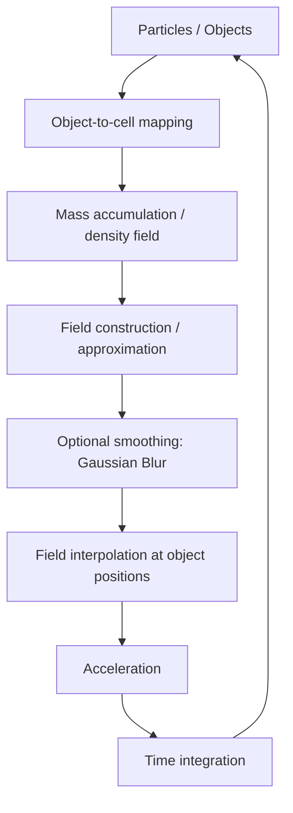
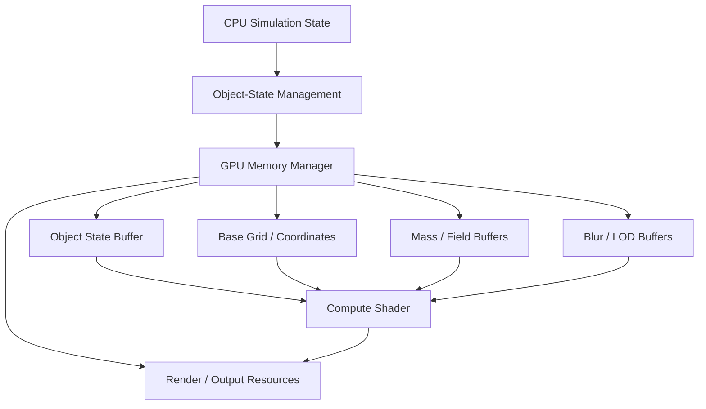
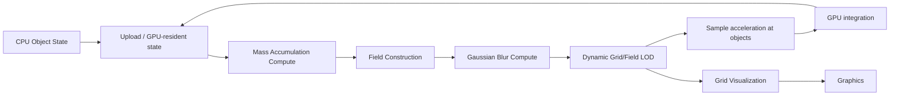
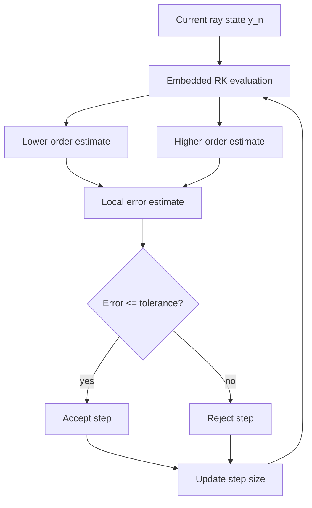
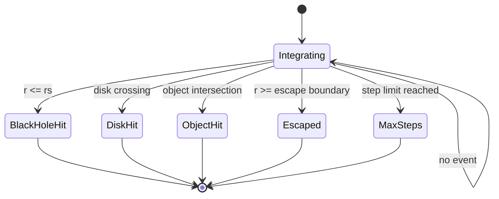
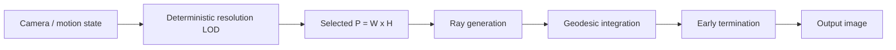
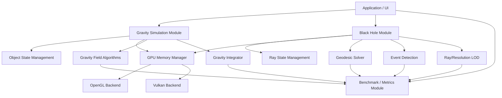
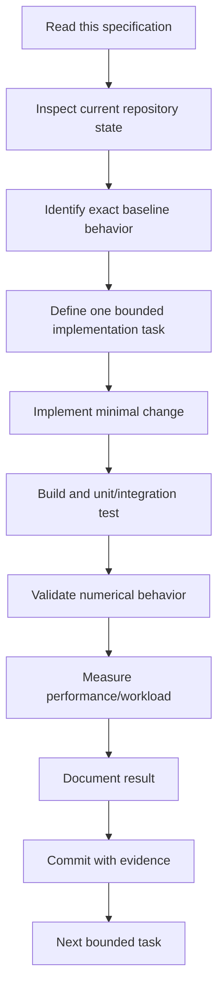
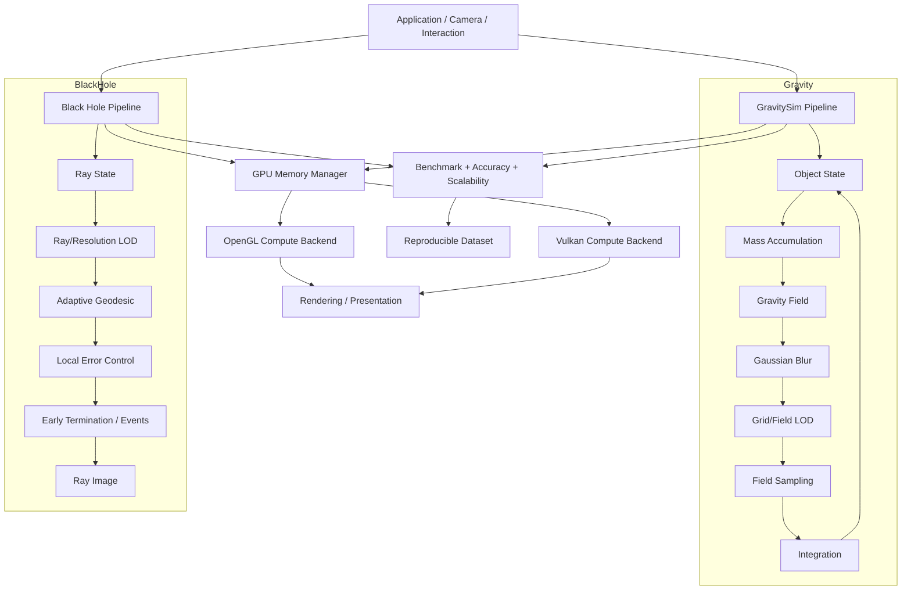

# Agent Project Specification
# Low-Computational-Cost Astrophysical Simulation: GravitySim + Black Hole

**Document type:** Master implementation specification for coding/research agents  
**Project period:** 2026-09 to 2027-01  
**Primary project:** `gravity_sim` + `black_hole`  
**Primary optimization direction:** algorithmic approximation + data-oriented state management + GPU Compute Shader + Dynamic LOD + numerical error control + experimental validation  
**Reference branch:** `quocthaile/gravity_sim: perf/gravity-3dgrid-hotpath`  
**Black-hole repository:** `quocthaile/black_hole: main`  
**Status snapshot:** 2026-09-20

---

## 0. Mission of the agent

The agent is not asked merely to "make the program faster". The project is a reproducible research/engineering study whose implementation must demonstrate, measure, and validate how computational cost changes when the two original simulation pipelines are optimized without silently changing the physical model.

The work has two independent but coordinated simulation pipelines:

1. **GravitySim**
   - Newtonian N-body dynamics.
   - Current baseline: Direct N-body pairwise force computation.
   - Target: grid-based approximation using Mass Accumulation, Gaussian Blur, Dynamic Grid/Field LOD, and GPU Compute Shader execution.

2. **Black Hole**
   - Schwarzschild black-hole visualization and null-geodesic ray tracing.
   - Current code already contains an OpenGL 4.3 Compute Shader path.
   - Target: fixed-step geodesic reference, Adaptive Geodesic Marching, Early Termination/event detection, Dynamic Ray/Resolution LOD, and GPU execution with explicit numerical-error control.

The final result must be evaluated using the same experimental methodology across baseline and optimized versions: fixed initial conditions, fixed simulation parameters, fixed hardware/software configuration, explicit workload variables, performance measurements, and numerical/physical accuracy measurements.

The agent must treat **runtime, frame time, memory, workload, and accuracy as first-class outputs**, not as secondary debugging information.

---

# 1. Source-of-truth hierarchy

When sources disagree, use the following order.

1. This specification for implementation intent and project workflow.
2. The KLTN detailed outline (`DECUONGKLTN.pdf`) for official research scope, milestones, metrics, and hypotheses.
3. The exact pinned repository code for current implementation behavior.
4. The original upstream repositories for historical baseline/reference behavior.
5. Scientific literature and official technology specifications for theoretical justification.
6. Agent inference only when explicitly labeled as inference; never present inference as an existing project requirement.

Do not silently replace source-defined terminology with a different algorithm. A proposed improvement must be explicitly described as an implementation decision, not as if it were already present in the source.

The project is **not** a complete redesign of astrophysical physics. The scope is optimization and numerical/implementation evaluation of the existing physical models, centered on Newtonian gravity and Schwarzschild geometry.

---

# 2. Repository and baseline snapshot

## 2.1 GravitySim repository

Repository:

- `https://github.com/quocthaile/gravity_sim`
- Active branch: `perf/gravity-3dgrid-hotpath`
- Branch snapshot observed on 2026-09-20: `e2a3b1fa8e018af6b99af12ac854422888cc7dd5`

Important current files:

```text
src/gravity_sim_3Dgrid.cpp
include/gravity_sim_3Dgrid_function.hpp
src/gravity_sim_3Dgrid_function.cpp
shaders/grid.comp
shaders/grid.vert
shaders/grid.frag

docs/object_state_management.md
docs/gravity_sim_3Dgrid_bindings.md
docs/gravity_sim_3Dgrid_architecture.txt
docs/GPU_memory_architecture.drawio
```

Current important architecture facts:

- `Object` remains the CPU-side authoritative simulation object.
- The CPU loop still performs Direct N-body gravity.
- `objectStateCpu` packs object state into two `glm::vec4` values.
- Current GPU object-state data contains position, mass, velocity, and Schwarzschild radius.
- `grid.comp` currently consumes object position and `rs` to compute grid deformation.
- The current Compute Shader therefore accelerates the **grid-deformation pass**, not the complete N-body integrator.
- Grid compute uses `layout(local_size_x = 16, local_size_y = 16) in;`.
- The current grid compute workload is one invocation per grid node, and each invocation loops through all active objects.
- The current compute output is stored in `deformedGridSSBO` and then copied GPU-to-GPU into `gridVBO` before graphics rendering.
- The current Object State SSBO uses binding 0; base grid uses binding 1; deformed grid uses binding 2.

## 2.2 Black Hole repository

Repository:

- `https://github.com/quocthaile/black_hole`
- Current `main` snapshot observed on 2026-09-20: `dc263bb5a1b72f5a24190d2e38b84b5c8fe9a317`
- This repository is a fork of the upstream `kavan010/black_hole` repository.

Important files:

```text
black_hole.cpp
CPU-geodesic.cpp
geodesic.comp
ray_tracing.cpp
2D_lensing.cpp
grid.vert
grid.frag
```

Current important architecture facts:

- `black_hole.cpp` creates an OpenGL 4.3 context.
- It has an OpenGL Compute Shader pipeline writing to an `image2D`.
- Camera, disk, and object information are uploaded through UBOs.
- `geodesic.comp` uses a `16 x 16` local workgroup.
- The compute resolution is currently `200 x 150`, while the presentation window is `800 x 600`.
- The CPU main loop still contains a gravity interaction loop over the objects.
- The CPU grid is rebuilt every frame.
- The current UBO object representation is limited to 16 objects.
- `CPU-geodesic.cpp` contains a CPU geodesic solver and an actual four-stage `rk4Step` implementation.

### Critical current-code observation

The function named `rk4Step` in `geodesic.comp` is **not a classical four-stage RK4 step**. It evaluates the RHS once and then applies one update. The CPU implementation in `CPU-geodesic.cpp` does contain four RHS evaluations (`k1`, `k2`, `k3`, `k4`).

Therefore:

```text
Do not treat the current GPU geodesic shader as the numerical reference.
Use a canonical fixed-step CPU geodesic implementation as the reference.
Then implement the optimized GPU solver and validate it against that reference.
```

This distinction is mandatory for the accuracy study.

---

# 3. Official project objectives

The project must satisfy the following research objectives.

## 3.1 Bottleneck identification

Measure and identify bottlenecks in both original simulation codes.

Required observations include:

- CPU execution time by stage.
- GPU execution time where applicable.
- Frame time.
- FPS.
- CPU utilization.
- GPU utilization.
- RAM.
- VRAM.
- allocation/reallocation overhead.
- CPU-GPU state transfer overhead.
- number of integration steps.
- number of RHS evaluations.

Use Visual Studio Performance Profiler for the Windows CPU-oriented baseline study and GPU Usage/frame timing tools where appropriate. Use vendor tools such as NVIDIA Nsight when available for deeper GPU analysis; the measurement methodology must not depend on one vendor-specific GPU.

## 3.2 Algorithmic optimization

GravitySim:

```text
Direct N-body
      |
      v
Mass Accumulation
      |
      v
Grid / Field representation
      |
      v
Gaussian Blur / smoothing approximation
      |
      v
Dynamic Grid/Field LOD
      |
      v
Object acceleration sampling + integration
```

Black Hole:

```text
Fixed-step geodesic reference
      |
      v
Adaptive Geodesic Marching
      |
      +----> local error estimation
      |
      +----> absolute/relative tolerance
      |
      v
Event detection / Early Termination
      |
      v
Dynamic Ray / Resolution LOD
      |
      v
GPU Compute execution
```

## 3.3 GPU execution

Move computationally parallel work onto the GPU in stages.

Do not attempt the entire migration in one change.

Required progression:

```text
CPU baseline
   |
   v
stable GPU data representation
   |
   v
OpenGL Compute Shader correctness
   |
   v
GPU algorithm validation
   |
   v
GPU performance measurement
   |
   v
Vulkan implementation layer
   |
   v
OpenGL vs Vulkan benchmark
```

Vulkan is an implementation/backend migration, not a substitute for algorithmic optimization. Vulkan must not be claimed to be faster until measured.

---

# 4. Research questions and hypotheses

These are research questions, not predetermined conclusions.

## RQ1 - Bottleneck behavior

How do the dominant stages of GravitySim and Black Hole change as workload increases?

Required workload dimensions:

```text
Gravity:       N, G
Black Hole:    P, S, M
```

where:

- `N` = number of simulated GravitySim objects.
- `G` = number of active Grid cells/nodes in a Grid/Field representation.
- `P = W x H` = number of image pixels/rays.
- `S` = number of geodesic integration steps.
- `M` = number of objects tested by one ray for intersection.

Also record actual integration steps and RHS evaluations because adaptive algorithms may make `S` variable per ray.

## RQ2 - Gravity approximation

Can Grid-based Mass Accumulation reduce computational cost and improve scalability relative to Direct N-body under the defined benchmark workloads while maintaining an acceptable gravitational-field and state error?

This is an experimental hypothesis. The implementation must not claim success before measurements exist.

## RQ3 - Gravity smoothing and LOD

How much additional workload reduction is obtained by Gaussian Blur and Dynamic Grid/Field LOD, and what numerical error is introduced by each technique?

## RQ4 - Adaptive geodesic integration

Can Adaptive Geodesic Marching reduce the number of integration steps/RHS evaluations compared with fixed-step integration while maintaining a specified local error tolerance and preserving event classification?

## RQ5 - Early termination

How many rays can terminate earlier because they have crossed an event boundary, hit the black hole/accretion disk/object, or escaped the simulation domain, and what effect does that have on runtime and numerical classification?

## RQ6 - Dynamic LOD

How does changing spatial or image sampling resolution with viewpoint/motion affect computational workload and numerical/visual error?

## RQ7 - GPU backend

What performance difference is measured when the same algorithm and workload are implemented using OpenGL Compute Shader versus Vulkan Compute?

The comparison must keep the algorithm, initial conditions, numerical parameters, and workload as constant as possible.

---

# 5. Physical theory: GravitySim

## 5.1 Newtonian two-body force

For two bodies with masses `m_i` and `m_j` separated by distance `r_ij`, Newtonian gravitational force magnitude is:

```text
F_ij = G m_i m_j / r_ij^2
```

The acceleration of body `i` is:

```text
a_i = sum_j != i G m_j (x_j - x_i) / |x_j - x_i|^3
```

The essential property for the computational problem is the all-to-all interaction: every target body may interact with every source body.

This gives the Direct N-body implementation the theoretical pair-count scaling:

```text
O(N^2)
```

The exact measured constant is implementation- and hardware-dependent.

## 5.2 Current GravitySim implementation

The current code computes every pair in nested CPU loops. It calculates a direction vector, distance, softened denominator, gravitational force, and acceleration for every source-target pair.

The current implementation also contains simulation-specific time scaling such as:

```text
velocity += acceleration / 96
position += velocity / 94
```

These constants must be treated as part of the current baseline behavior. Do not replace them with a new physical timestep merely because a more conventional integrator would normally be preferable. A change to timestep semantics would be a separate numerical-model experiment.

## 5.3 Softened interaction in the current baseline

The current code uses a denominator of the form:

```text
r^2 + epsilon^2
```

with `epsilon = 10.0` in the observed implementation.

Do not label this as a particular standard softening scheme unless the equation is formally matched to that scheme. For this project it is sufficient to call it the **baseline softened denominator** and preserve it when comparing algorithms.

## 5.4 Collision behavior

The current `Object::CheckCollision` uses a simple velocity multiplier when two object radii overlap. The current response is not a momentum-conserving rigid-body collision model.

Therefore the optimizer must not silently turn this into a physically different collision model. Collision behavior is outside the main optimization hypothesis unless explicitly isolated as another experiment.

---

# 6. Particle-Mesh / Grid approximation concepts

The scientific basis for the Grid approach is the Particle-Mesh family of methods: particles are represented on a mesh or grid to obtain an approximate field representation, replacing or reducing direct particle-particle evaluation.

The conceptual pipeline is:



Important scientific distinction:

**Mass accumulation alone is not a gravitational field solver.**

It creates a discrete representation of mass density. The project must explicitly define how that representation becomes the field/acceleration used by objects. Gaussian smoothing can approximate a spatially smoothed field, but Gaussian Blur is not by itself equivalent to solving the Newtonian Poisson equation.

Therefore every implementation must document:

1. what quantity is accumulated,
2. where it is stored,
3. how the field is constructed from that quantity,
4. how the field is sampled/interpolated at object positions,
5. what approximation error is introduced.

The KLTN scope intentionally focuses on Mass Accumulation, Gaussian Blur, Grid/Field LOD, and GPU execution. Do not introduce FFT Poisson solvers, Barnes-Hut, Fast Multipole Methods, or other major algorithms into the main experiment unless a separate extension is explicitly created.

## 6.1 Mass Accumulation

For each object:

```text
position -> grid coordinates -> cell index -> accumulate mass
```

The mapping stage can be approximately:

```text
O(N)
```

when object-to-cell mapping is O(1).

The actual total Gravity pipeline cost is not necessarily O(N), because subsequent field construction, smoothing, sampling, and integration have their own workload. Complexity must therefore be reported by stage.

## 6.2 Grid quantity

`G` denotes the number of Grid cells/nodes involved in the computation.

A 2D visualization Grid with `D` divisions per axis contains:

```text
(D + 1)^2
```

nodes.

The implementation must not assume that a visualization Grid is automatically a physically correct gravitational-field Grid. Keep the visual deformation and physical acceleration representations conceptually separate, even if they share memory infrastructure.

## 6.3 Field sampling

For an object position that lies between Grid nodes/cells, the field should be obtained by an explicitly documented interpolation rule.

The project must measure the difference between interpolated acceleration and Direct N-body reference acceleration.

---

# 7. Gaussian Blur theory and role

Gaussian Blur represents convolution of a discrete field with a Gaussian kernel.

For a 1D Gaussian:

```text
G(x) = exp(-x^2 / (2 sigma^2)) / (sqrt(2 pi) sigma)
```

For a separable 2D Gaussian kernel:

```text
K(x,y) = G(x) G(y)
```

A separable implementation can perform a horizontal and vertical pass rather than evaluating the full 2D kernel at every sample.

The KLTN complexity model specifies:

```text
O(G K)
```

where `G` is the number of Grid elements and `K` is kernel size.

The agent must report the actual implementation cost rather than using only asymptotic notation.

Gaussian Blur has two different project roles and they must not be conflated:

1. **Computational approximation:** smooth local field information to reduce high-frequency spatial variation and potentially permit lower resolution.
2. **Visual smoothing:** make Grid deformation visually continuous.

For the scientific experiment, the first role is important. The optimized physical field must be validated against the Direct N-body reference.

---

# 8. Dynamic Grid / Field LOD

Level of Detail (LOD) means controlling computational resolution according to relevance.

For GravitySim the LOD variable is spatial resolution:

```text
camera / object relevance
        |
        v
selected Grid resolution
        |
        v
G decreases or increases
        |
        v
field workload changes
```

The main scientific trade-off is:

```text
lower G -> lower computational cost
       -> potentially larger spatial approximation error
```

The agent must measure both sides of this trade-off.

LOD must not depend on measured FPS in a way that changes the benchmark workload unpredictably. The LOD policy used in a benchmark must be deterministic from explicitly recorded simulation/camera state.

The LOD study must report:

- selected resolution,
- effective Grid workload `G`,
- runtime,
- field/acceleration error,
- object-state error,
- visual result where relevant.

---

# 9. Data-oriented state architecture for GravitySim

## 9.1 Object-State Management

The CPU `Object` remains the authoritative simulation object during the initial migration.

Current state classification:

| State category | Current field | Meaning |
|---|---|---|
| Simulation state | `position` | dynamic spatial state |
| Simulation state | `velocity` | dynamic velocity state |
| Physical parameter | `mass` | source strength / mass |
| Physical parameter | `density` | physical density |
| Derived state | `radius` | body radius derived from mass/density |
| Derived state | `rs` | Schwarzschild radius |
| Auxiliary state | `lastPos` | previous position / auxiliary state |
| Interaction state | `initializing` | UI/simulation interaction |
| Interaction state | `launched` | launch state |
| Interaction state | `target` | interaction target |
| Rendering state | `VAO`, `VBO`, `color` | graphics resources/appearance |

Do not move all fields into GPU memory just because a GPU buffer exists.

The correct ownership rule is:

```text
CPU Object
   |
   | authoritative simulation state
   v
Object-State Snapshot
   |
   | upload
   v
GPU buffer
   |
   +--> compute kernels
   +--> field construction
   +--> rendering-related compute
```

Later, when GPU integration becomes authoritative, the architecture can change to GPU-resident state with explicit readback only when needed. That is a separate migration stage.

## 9.2 Current packed GPU representation

Current CPU transfer structure:

```cpp
struct objectStateCpu
{
    glm::vec4 position_mass;
    glm::vec4 velocity_radius;
};
```

Logical representation:

```text
position_mass.xyz  -> position
position_mass.w    -> mass
velocity_radius.xyz -> velocity
velocity_radius.w  -> Schwarzschild radius
```

Current Compute Shader representation:

```glsl
struct SphereState
{
    vec4 position_mass;
    vec4 velocity_radius;
};
```

Current shader uses position and `rs` for Grid deformation; mass and velocity are preserved for future computational stages.

## 9.3 AoS vs SoA policy

The CPU object model may remain object-oriented. Performance-sensitive GPU data should be treated as a data-oriented representation separate from the high-level object API.

Do not refactor `Object` into an inheritance hierarchy for performance by default.

Use this boundary:

```text
Object API / ownership
        |
        v
Hot-path data snapshot
        |
        +---- tightly packed arrays / records
        |
        v
GPU memory
```

Whether a final GPU representation is Array of Structures, Structure of Arrays, or a hybrid must be decided from access patterns and measured memory behavior. The agent must not claim that one layout is universally faster.

---

# 10. GPU Memory Manager

The GPU Memory Manager is an infrastructure layer. It is not itself the numerical algorithm.

Responsibilities:

1. Resource creation.
2. Resource capacity tracking.
3. Stable binding/descriptor management.
4. Allocation and reallocation outside the critical per-frame path where possible.
5. Upload/update operations.
6. Lifetime and cleanup.
7. GPU synchronization/resource-state tracking.
8. Debug validation of size/layout/binding contracts.
9. Future support for Grid, Mass Field, Blur Field, LOD buffers, object state, and result buffers.

Conceptual architecture:



## 10.1 Capacity principle

Current GravitySim already uses a capacity policy rather than reallocating the object-state SSBO every frame.

The agent must preserve the principle:

```text
logical count != allocated capacity
```

The GPU buffer should be large enough for the current active range while avoiding unnecessary reallocations for small changes.

## 10.2 Binding contract

For OpenGL, the binding number is the contract between C++ and GLSL.

Current bindings:

| Binding | Resource | Access | Current role |
|---:|---|---|---|
| 0 | object state SSBO | read | object state |
| 1 | base Grid SSBO | read | undeformed Grid positions |
| 2 | deformed Grid SSBO | write | compute result |

Future resources must be registered centrally instead of scattering magic binding numbers through the code.

## 10.3 UBO vs SSBO vs image

Use:

- **UBO** for small parameter blocks that are mainly read-only during a dispatch, such as camera parameters and algorithm parameters.
- **SSBO** for variable-sized object arrays, Grid arrays, fields, and general storage data.
- **image2D / storage image** for 2D compute outputs such as the Black Hole ray-traced image.
- **VBO/VAO/EBO** for graphics vertex/index input, not as the primary numerical storage model.

---

# 11. OpenGL Compute Shader concepts required by the agent

A Compute Shader is not a Vertex Shader with a different file extension. It is a separate programmable execution model.

## 11.1 Workgroup and invocation

For:

```glsl
layout(local_size_x = 16, local_size_y = 16) in;
```

one workgroup contains:

```text
16 x 16 = 256 invocations
```

The CPU dispatch specifies the number of workgroups:

```cpp
glDispatchCompute(groupCountX, groupCountY, groupCountZ);
```

The relationship is:

```text
total invocations
    = groupCountX * groupCountY * groupCountZ
      * local_size_x * local_size_y * local_size_z
```

For 2D Grid computation:

```text
groupCountX = ceil(gridWidth  / local_size_x)
groupCountY = ceil(gridHeight / local_size_y)
groupCountZ = 1
```

An out-of-range guard is required when the resolution is not exactly divisible by the local size.

## 11.2 Built-in IDs

The important GLSL identifiers are:

```text
gl_WorkGroupID
    identifies the workgroup

gl_LocalInvocationID
    identifies the invocation inside the workgroup

gl_GlobalInvocationID
    identifies the invocation globally across the dispatch
```

The practical mapping for a Grid is:

```text
x = gl_GlobalInvocationID.x
z/y = gl_GlobalInvocationID.y
```

The Compute Shader should map that invocation to exactly one data element whenever possible.

## 11.3 Uniform

A GLSL `uniform` is not the same thing as a workgroup or dispatch dimension.

Use uniforms for small parameters such as:

```text
objectCount
Grid width
Grid height
simulation parameters
tolerance parameters
```

Use SSBOs/images for large data collections.

## 11.4 Synchronization

When one compute pass writes a storage resource and a later pass reads it, a memory barrier/resource synchronization operation is required according to the API's memory model.

Current GravitySim performs:

```text
Compute Shader
    |
    | GL_SHADER_STORAGE_BARRIER_BIT
    v
SSBO-to-VBO copy
    |
    | GL_VERTEX_ATTRIB_ARRAY_BARRIER_BIT
    v
Vertex fetch / graphics
```

This pattern must remain explicit and documented.

---

# 12. Gravity GPU pipeline target

The final Gravity GPU direction is not simply "move the current vertex shader to Compute Shader". The goal is to move computationally parallel stages progressively.

Target conceptual pipeline:



The implementation may initially keep CPU integration while the field computation is moved to GPU. The final stage can move integration to GPU once correctness is established.

Do not move authoritative state to GPU before a reference validation path exists.

---

# 13. Gravity benchmark complexity model

The theoretical models required by the KLTN outline are:

| Stage | Workload | Theoretical model |
|---|---|---:|
| Direct N-body | `N` | `O(N^2)` |
| Mass Accumulation mapping | `N` | `O(N)` when object-to-cell mapping is `O(1)` |
| Gaussian Blur | `G`, `K` | `O(GK)` for the specified implementation model |
| Dynamic Grid/Field LOD | `N`, Grid resolution | resolution-dependent workload; record actual `G` |

Do not write a single complexity label for the entire optimized pipeline. Report the complexity of each stage and then compare measured end-to-end runtime.

A theoretical complexity improvement does not imply a speedup at small workloads because constant factors, memory movement, dispatch overhead, synchronization, and implementation overhead can dominate.

---

# 14. Gravity accuracy validation

Direct N-body is the primary numerical reference for GravitySim.

Measure:

1. Force/acceleration error.
2. Gravitational-field error.
3. Position error.
4. Velocity error.
5. Total-energy drift.

Conceptually:

```text
optimized result
      |
      v
compare with Direct N-body reference
      |
      +--> field / acceleration error
      +--> state trajectory error
      +--> energy drift
```

## 14.1 Timestep convergence

Because the simulation is time-integrated, perform a timestep convergence study.

The purpose is to distinguish:

```text
spatial approximation error
from
integration/time-discretization error
```

Do not attribute all error to the Grid approximation when timestep error has not been controlled.

## 14.2 Grid / field convergence

Increase spatial resolution and determine whether the computed field/state approaches the reference behavior.

Conceptually:

```text
coarse G
  |
  v
larger approximation error
  |
  v
finer G
  |
  v
convergence toward reference
```

The agent must preserve the same physical initial conditions and integration settings while varying spatial resolution during this study.

---

# 15. Black Hole physical theory

The Black Hole pipeline uses a Schwarzschild black hole, i.e. a non-rotating, spherically symmetric solution.

The characteristic radius is:

```text
r_s = 2 G M / c^2
```

The Schwarzschild metric can be written using:

```text
f(r) = 1 - r_s / r
```

and:

```text
ds^2 = -f(r) c^2 dt^2
       + dr^2 / f(r)
       + r^2 (dtheta^2 + sin(theta)^2 dphi^2)
```

The project is not implementing arbitrary General Relativity. It specifically uses the Schwarzschild metric and null geodesics as defined by the existing code/model.

## 15.1 Null geodesic state

The code's numerical state is represented by quantities including:

```text
r
theta
phi
dr/dlambda
dtheta/dlambda
dphi/dlambda
```

with conserved quantities such as energy-like `E` and angular momentum `L` used by the existing equations.

## 15.2 Geodesic RHS

The existing implementation defines a first-order system from the second-order geodesic equations.

Conceptually:

```text
y = [r, theta, phi, dr, dtheta, dphi]

y' = f(y)
```

The numerical solver therefore solves an initial-value problem for an ODE system.

---

# 16. Fixed-step geodesic reference

The fixed-step solver is the Black Hole reference implementation.

It must have:

- explicit step size `d_lambda`,
- explicit maximum step count,
- deterministic event checks,
- double precision where required by the numerical reference,
- actual four-stage classical RK4 if RK4 is the selected fixed-step reference.

Classical RK4 has:

```text
k1 = f(t_n, y_n)

k2 = f(t_n + h/2, y_n + h k1/2)

k3 = f(t_n + h/2, y_n + h k2/2)

k4 = f(t_n + h,   y_n + h k3)

 y_(n+1) = y_n + h/6 (k1 + 2 k2 + 2 k3 + k4)
```

The number of RHS evaluations for a pure RK4 step is therefore four.

This is why the KLTN complexity model includes:

```text
O(P S)
```

for geodesic integration and:

```text
O(4 P S)
```

for the RHS evaluation workload of classical RK4.

The optimized GPU implementation must preserve this numerical meaning before introducing adaptive integration.

---

# 17. Adaptive Geodesic Marching

Adaptive Geodesic Marching chooses the integration step based on estimated local numerical error.

The project outline references embedded Runge-Kutta methods, particularly Dormand-Prince.

An embedded method computes two approximations of different order from related RHS evaluations. Their difference gives a local error estimate without a completely separate full solution.

Conceptual flow:



## 17.1 Absolute and relative tolerance

The numerical acceptance criterion must distinguish the scale of the solution.

A standard componentwise form is:

```text
|e_i| <= max(atol_i, rtol * |y_i|)
```

where:

- `e_i` = estimated local error for component `i`.
- `atol_i` = absolute tolerance for component `i`.
- `rtol` = relative tolerance.
- `y_i` = current/estimated solution component.

This means:

- `atol` controls the error floor for components close to zero.
- `rtol` controls error relative to the scale of a component.

The implementation must document how a vector of errors is reduced to a single acceptance criterion if vector/norm control is used.

## 17.2 Step-size control

A rejected step must not advance the ray state.

An accepted step advances the state and updates the next trial step size using the embedded error estimate.

A standard controller has the general form:

```text
h_new = safety * h * (tolerance / error)^(1/p)
```

where `p` is related to the order used by the error estimate. The exact controller, safety factor, minimum/maximum step policy, and rejection policy must be explicit in the implementation and benchmark configuration.

Do not select tolerance values solely because they produce a desired visual result. Tolerance values must be part of the accuracy/performance experiment.

---

# 18. Early Termination and event detection

Early Termination means stopping integration when the final outcome is already determined.

Required event categories from the current pipeline include:

1. Event horizon / black-hole intersection.
2. Accretion-disk crossing.
3. Object intersection.
4. Escape from the simulation domain.
5. Maximum integration step/iteration guard.

Conceptual state machine:



## 18.1 Event accuracy

A simple post-step event test may classify the event but can locate the event poorly.

For high numerical fidelity, the agent should distinguish:

```text
event classification
from
event location accuracy
```

When a ray crosses an event surface between two states, the implementation should preserve the endpoint states and, where necessary for the selected accuracy requirement, refine the crossing location.

Do not add event refinement without measuring whether it materially affects the required metric. Event refinement itself has computational cost.

## 18.2 Current implementation limitation

The observed GPU shader defines an escape radius of `1e30` while using `D_LAMBDA = 1e7` and a maximum of `60000` steps. The maximum accumulated lambda under those constants is far below the stated escape radius, so that escape condition is effectively unreachable under the current maximum-step configuration.

This is a baseline implementation observation, not a reason to silently change the baseline. The benchmark document must record it and the optimized event model must define a meaningful escape boundary as part of the controlled configuration.

---

# 19. Dynamic Ray / Resolution LOD for Black Hole

Black Hole LOD operates primarily in image/sampling resolution, not Grid-cell resolution.

The workload relation is:

```text
P = W x H
```

and total ray integration work is approximately related to:

```text
P x S
```

with object intersection adding an `M` factor when every ray step tests all `M` objects.

The KLTN worst-case model is therefore:

```text
O(P S M)
```

for the relevant ray/object interaction stage.

The current code has a `moving` flag and two code branches, but the observed shader currently assigns the same compute resolution in both branches. This is not a complete Dynamic LOD implementation.

Target behavior:



The LOD experiment must measure:

- selected `P`,
- number of rays actually launched,
- integration steps actually executed,
- RHS evaluations,
- runtime,
- trajectory/deflection/hit classification error.

Do not use a resolution policy that changes after observing benchmark results unless that policy is frozen before the final experiment.

---

# 20. Black Hole object-intersection cost

The current Compute Shader loops over objects for ray intersection.

If every ray step checks every object, the theoretical interaction workload is:

```text
O(P S M)
```

where:

- `P` = rays,
- `S` = steps per ray,
- `M` = objects tested per ray step.

This is a major scalability concern when `M` grows.

The main KLTN scope focuses on Adaptive Geodesic Marching, Early Termination, and Dynamic LOD. Do not silently substitute a new spatial acceleration structure for object intersection in the main experiment.

If an acceleration structure is later studied, it must be a separately named experiment and must have its own complexity model and accuracy validation.

---

# 21. Black Hole accuracy validation

Required metrics:

1. Trajectory error.
2. Conserved energy error.
3. Conserved angular-momentum error.
4. Deflection-angle error.
5. Ray hit/miss classification.
6. Number of integration steps.
7. Number of RHS evaluations.

Reference hierarchy:

```text
Analytical solution where available
          |
          v
high-accuracy numerical reference
          |
          v
fixed-step RK4 reference
          |
          v
optimized adaptive/GPU solver
```

The reference must be materially more accurate than the optimized case for the comparison being made. A reference cannot simply be another configuration with approximately the same numerical error.

## 21.1 Conserved quantities

A null geodesic in a static spherical Schwarzschild spacetime has conserved quantities associated with spacetime symmetries, including conserved energy and angular momentum quantities used by the model.

Numerical integration should approximately preserve the corresponding invariant quantities. Drift is evidence of numerical integration error, coordinate/state error, or implementation error.

## 21.2 Deflection angle

For a ray that escapes after passing near the black hole, compare the simulated incoming and outgoing asymptotic directions against the selected reference.

This metric is especially important because a visually similar image can hide trajectory error.

## 21.3 Hit/miss classification

For event-driven ray tracing:

```text
reference classification
        vs
optimized classification
```

Report misclassification rate or confusion counts, not only average continuous trajectory error.

A one-pixel image difference may matter little visually while a wrong event classification may indicate a substantial numerical problem.

---

# 22. Numerical error taxonomy

Every reported error must be attributed to a source category where possible.

```text
Total observed difference
       |
       +--> spatial approximation error
       |
       +--> temporal discretization / timestep error
       |
       +--> ODE integration error
       |
       +--> floating-point / precision error
       |
       +--> event-location error
       |
       +--> LOD / sampling error
       |
       +--> implementation/data-transfer error
```

Do not attribute an error to GPU execution merely because it appears in the GPU version.

A GPU and CPU implementation can produce numerically different results due to precision, operation ordering, compiler behavior, or algorithmic differences. The experiment must isolate these factors.

---

# 23. Floating-point and numerical precision policy

The agent must track where the implementation uses:

- CPU `float`.
- CPU `double`.
- GLSL `float`.
- GLSL `double` where supported and appropriate.
- integer index types.
- buffer offsets and counts.

Large astrophysical coordinates such as `1e10` to `1e20` magnitudes can make single-precision absolute resolution significant.

Therefore:

1. Do not convert `double` to `float` merely to fit a GPU data structure.
2. Do not assume GPU `float` results are numerically equivalent to CPU `double` results.
3. Record the precision model of each benchmark.
4. Compare optimized calculations against a reference with known precision.
5. When a precision change is required for GPU feasibility, isolate it as an explicit implementation variable.

---

# 24. GPU/CPU data movement

Data transfer can dominate an apparently parallel algorithm.

Required measurement categories:

```text
CPU state preparation
CPU -> GPU upload
GPU computation
GPU synchronization
GPU -> GPU copy
GPU -> CPU readback, if any
rendering
```

The preferred data path for hot numerical results is:

```text
GPU compute
    |
    v
GPU storage buffer/image
    |
    +--> next GPU pass
    +--> rendering
```

Avoid:

```text
GPU -> CPU -> GPU
```

inside the critical frame loop unless required for correctness or interaction.

The current GravitySim Grid path already demonstrates GPU-to-GPU transfer from `deformedGridSSBO` to `gridVBO`. Preserve this pattern when it is appropriate.

---

# 25. Vulkan migration

The project outline includes migration from OpenGL to Vulkan.

The agent must understand the conceptual mapping.

| OpenGL Compute concept | Vulkan concept |
|---|---|
| Compute Program | Compute Pipeline |
| `glDispatchCompute` | `vkCmdDispatch` |
| SSBO | Storage Buffer descriptor |
| UBO | Uniform Buffer descriptor |
| image load/store | Storage Image descriptor |
| binding point | Descriptor binding / descriptor set |
| memory barrier | Pipeline barrier / synchronization2 dependency |
| global mutable GL resource state | Explicit command/pipeline/resource state |

Vulkan is explicit. Synchronization must identify the producing stage/access and the consuming stage/access.

Example target dependency:

```text
Compute pass A writes storage buffer
        |
        v
compute-to-compute synchronization
        |
        v
Compute pass B reads storage buffer
```

Another target dependency:

```text
Compute writes storage buffer
        |
        v
compute-to-graphics synchronization
        |
        v
Graphics consumes resource
```

The Vulkan version must use the same logical data flow as the OpenGL version before performance is compared.

---

# 26. Benchmark methodology

## 26.1 Freeze baseline

Before optimization:

1. Record repository URL.
2. Record branch.
3. Record commit SHA.
4. Record compiler/version.
5. Record build mode.
6. Record dependency versions.
7. Record OpenGL/Vulkan driver information.
8. Record GPU model.
9. Record CPU model.
10. Record RAM.
11. Record OS.
12. Record screen/window configuration.
13. Record initial conditions.
14. Record simulation parameters.
15. Record numerical parameters.

The baseline implementation must not be edited during the final baseline benchmark collection.

## 26.2 Workload axes

### GravitySim

Primary axes:

```text
N = number of objects
G = number of Grid/Field cells/nodes
```

Secondary controlled conditions:

```text
initial positions
initial velocities
masses
densities
simulation duration
time integration settings
camera state
```

### Black Hole

Primary axes:

```text
P = W x H rays
S = geodesic integration steps
M = intersectable objects
```

Also record:

```text
actual steps executed
actual RHS evaluations
number of early terminations
number of hits
number of misses
```

## 26.3 Stage-level timing

The benchmark must split frame time into stages where practical.

Gravity example:

```text
Input / camera
Object update
Direct N-body or Mass Accumulation
Field construction
Gaussian Blur
LOD selection
Object field sampling
Integration
GPU upload
GPU dispatch
Grid rendering
Object rendering
Present
```

Black Hole example:

```text
Camera / input
Grid generation, if enabled
Ray initialization
Geodesic integration
Event tests
Object intersection
LOD selection
GPU upload
Compute dispatch
Image synchronization
Fullscreen rendering
Present
```

The exact decomposition must be consistent across baseline and optimized paths.

---

# 27. Frame time and FPS

Frame time is measured in milliseconds per frame.

The idealized relation is:

```text
FPS ~= 1000 / frame_time_ms
```

For example, a 60 FPS frame budget corresponds to approximately 16.67 ms.

However, this does not mean every stage must individually be below 16.67 ms. The full frame budget is shared by all stages.

Always report both Frame Time and FPS because FPS can visually hide the magnitude of performance changes at different frame times.

Frame-time spikes must be visible in the benchmark data rather than reduced to one average.

---

# 28. CPU/GPU utilization interpretation

Utilization is not a direct synonym for performance.

Examples:

```text
Low GPU utilization + high CPU time
    -> CPU-bound pipeline

High GPU utilization + high GPU frame time
    -> GPU compute/render bound

Low utilization + high synchronization time
    -> dependency / pipeline / transfer bottleneck
```

Do not conclude "GPU is faster" merely because CPU utilization decreased.

The benchmark must connect utilization to measured stage time and workload.

---

# 29. Memory metrics

Required memory metrics:

- RAM usage.
- VRAM usage where available.
- GPU buffer sizes.
- logical object count.
- allocated object capacity.
- Grid/Field allocation sizes.
- temporary field buffers.
- image/output memory.
- allocation/reallocation count.

The project specifically aims to eliminate unnecessary per-frame allocations in hot paths.

Memory growth must therefore be distinguished between:

```text
intentional capacity growth
and
accidental per-frame allocation
```

---

# 30. Ablation study: GravitySim

The required conceptual comparison is:

```text
A: Direct N-body
B: Mass Accumulation
C: Mass Accumulation + Gaussian Blur
D: Mass Accumulation + Gaussian Blur + Dynamic Grid/Field LOD
```

The comparison must isolate contribution.

For each configuration measure:

```text
runtime
Frame Time
FPS
CPU/GPU time
CPU/GPU utilization
RAM/VRAM
workload
field error
acceleration error
position error
velocity error
energy drift
```

GPU execution and API backend should be treated as a separate experimental axis where possible. Do not mix an algorithm change and a backend change and then attribute the complete difference to one technique.

---

# 31. Ablation study: Black Hole

Required conceptual comparison:

```text
A: Fixed-step geodesic
B: Adaptive Geodesic Marching
C: Adaptive + Early Termination
D: Adaptive + Early Termination + Dynamic LOD
```

Also evaluate the individual effect of:

- Adaptive integration.
- Early Termination.
- Dynamic LOD.

For each configuration measure:

```text
runtime
Frame Time
FPS
CPU/GPU execution time
CPU/GPU utilization
RAM/VRAM
P
actual S
RHS evaluations
hit/miss classification
trajectory error
deflection-angle error
energy/angular-momentum error
```

---

# 32. Scalability study

Scalability asks how computational cost changes as workload changes.

Do not report only one "before vs after" number.

Required graphs should include relationships such as:

```text
runtime vs N
runtime vs G
runtime vs P
runtime vs actual S
runtime vs M
memory vs N
memory vs G
memory vs P
error vs G
error vs LOD level
error vs tolerance
RHS evaluations vs tolerance
```

The exact graph set may be reduced when a variable is not applicable to a pipeline, but every conclusion must be supported by measured data.

---

# 33. Statistical measurement rules

Benchmark measurements are experimental data.

The agent should:

1. Perform a warm-up period where applicable.
2. Avoid measuring shader compilation in the steady-state frame benchmark.
3. Avoid measuring initial GPU buffer allocation as if it were steady-state simulation cost.
4. Repeat workloads sufficiently to distinguish normal variability from a real change.
5. Record mean and a robust measure of spread.
6. Record outliers/frame-time spikes rather than silently deleting them.
7. Keep benchmark configuration unchanged after measurement begins.

The final benchmark dataset must contain raw measurements in machine-readable form.

---

# 34. Reproducibility requirements

Every benchmark result must be reproducible from:

```text
repository commit
build configuration
hardware
software
initial conditions
simulation parameters
workload
algorithm configuration
numerical tolerances
LOD policy
measurement methodology
```

The benchmark runner should write a metadata record beside the measured data.

Recommended conceptual record:

```text
Benchmark ID
Commit SHA
Build type
CPU
GPU
Driver
OS
Algorithm
Backend
N
G
P
S
M
timestep
geodesic step
rtol
atol
LOD state
run index
stage timings
frame timing
memory
accuracy metrics
```

Do not invent fields that cannot be measured. Every recorded field must have a defined meaning.

---

# 35. Common implementation pitfalls to prevent

## 35.1 Calling an Euler step RK4

Never use the name `rk4Step` for a one-RHS Euler update.

The implementation must either:

```text
implement actual RK4
```

or

```text
rename the function to the actual numerical method
```

For the fixed-step reference, use the actual RK4 formulation.

## 35.2 Using a visual Grid as the physical field without validation

A visually plausible curved surface is not evidence that the computed acceleration is correct.

The field must be compared numerically against Direct N-body.

## 35.3 Treating Gaussian Blur as gravity solving

Gaussian Blur smooths a field; it does not automatically solve the Newtonian gravitational field equation.

The code and report must define exactly what quantity is blurred and why the resulting approximation is being used.

## 35.4 Benchmarking with debug I/O

Per-object/per-step `cout` output can dominate runtime.

Debug logging must be disabled or measured as a separate overhead experiment before performance conclusions are made.

## 35.5 Per-frame allocation

Do not allocate/deallocate large vectors, buffers, shader resources, textures, or temporary data structures on every frame unless the experiment explicitly measures that cost.

## 35.6 CPU-GPU synchronization for every result

Do not perform GPU-to-CPU readback for intermediate field data on every frame when the next stage can run on the GPU.

## 35.7 Comparing different workloads

An optimized 400x300 ray image cannot be compared directly with a baseline 800x600 image and called an algorithmic speedup without reporting the workload difference.

LOD must be reported as a workload change.

## 35.8 Changing physics and optimization simultaneously

Changing:

```text
physical formula
+ numerical integrator
+ data layout
+ GPU backend
+ LOD
```

in one commit destroys causal interpretability.

Use incremental experiments.

---

# 36. Required code architecture direction

The target architecture should separate concerns.



The purpose is not to create a huge framework. The minimum design goal is to prevent physics, memory management, rendering, and benchmark measurement from becoming inseparable.

---

# 37. Suggested module responsibilities

## GravitySim

```text
GravitySimulation
ObjectState
DirectNBodySolver
MassAccumulator
GravityField
GaussianBlur
GridLOD
GravityIntegrator
```

Responsibilities:

- `DirectNBodySolver`: baseline force/acceleration.
- `MassAccumulator`: particle-to-cell mapping.
- `GravityField`: construction and sampling of the approximate field.
- `GaussianBlur`: explicit field smoothing pass.
- `GridLOD`: deterministic resolution selection.
- `GravityIntegrator`: state integration.
- `ObjectState`: authoritative CPU state or GPU state according to migration stage.

## Black Hole

```text
BlackHoleSimulation
RayState
FixedStepGeodesicSolver
AdaptiveGeodesicSolver
EventDetector
RayLOD
ObjectIntersection
RayOutput
```

Responsibilities:

- `FixedStepGeodesicSolver`: reference.
- `AdaptiveGeodesicSolver`: adaptive optimized solver.
- `EventDetector`: horizon/disk/object/escape events.
- `RayLOD`: image/sampling workload policy.
- `ObjectIntersection`: current all-object intersection stage.
- `RayOutput`: output image.

---

# 38. OpenGL execution sequence: Gravity target

```text
CPU updates / prepares Object state
        |
        v
Object State upload
        |
        v
Mass Accumulation Compute
        |
        v
Field Compute
        |
        v
Gaussian Blur Compute
        |
        v
LOD-dependent field selection
        |
        v
Acceleration sampling
        |
        v
Integration
        |
        v
Grid deformation / visualization
        |
        v
Graphics rendering
```

Use barriers only where resource dependencies require them.

Do not insert full GPU/CPU synchronization after every dispatch simply to make debugging easier in the release benchmark.

---

# 39. OpenGL execution sequence: Black Hole target

```text
Camera state
     |
     v
Ray-resolution LOD
     |
     v
Camera/scene upload
     |
     v
Compute dispatch
     |
     +--> ray initialization
     |
     +--> adaptive geodesic step
     |       |
     |       +--> local error estimate
     |       +--> tolerance test
     |       +--> accept/reject
     |
     +--> event detection
     |       |
     |       +--> horizon
     |       +--> disk
     |       +--> objects
     |       +--> escape
     |
     v
image2D output
     |
     v
Fullscreen graphics pass
     |
     v
Present
```

---

# 40. GPU work mapping rules

The agent must reason in terms of data parallelism.

## Gravity Grid

One natural mapping is:

```text
one invocation -> one Grid cell/node
```

For Mass Accumulation:

```text
one invocation -> one object
```

but multiple objects may map to the same cell. This introduces write conflicts and therefore requires an explicitly chosen reduction/atomic strategy.

Do not assume that `atomicAdd` automatically gives the best performance. Measure contention and memory behavior.

For field evaluation:

```text
one invocation -> one Grid cell/node
```

For object sampling:

```text
one invocation -> one object
```

## Black Hole

A natural mapping is:

```text
one invocation -> one image pixel / ray
```

The expensive work is then the variable-length loop inside each invocation.

This creates a potential workload imbalance because different rays may take different numbers of integration steps.

Adaptive stepping and Early Termination therefore affect both total work and GPU execution balance.

---

# 41. GPU workload imbalance

For fixed-step integration:

```text
most rays execute similar S
```

For adaptive integration:

```text
ray A -> 20 steps
ray B -> 500 steps
ray C -> 40 steps
...
```

This creates divergence/imbalance inside GPU execution groups.

The agent must measure whether the reduction in total numerical work outweighs the cost of divergent control flow.

This is exactly why the project needs both:

```text
number of steps
and
actual wall-clock GPU time
```

Neither metric alone is sufficient.

---

# 42. CUDA terminology versus OpenGL/Vulkan terminology

The project is implemented with OpenGL and may use Vulkan. Do not incorrectly mix CUDA API terminology into implementation descriptions.

Conceptual correspondence:

| CUDA-style concept | OpenGL Compute | Vulkan Compute |
|---|---|---|
| Grid | dispatch dimensions | dispatch group counts |
| Block | workgroup | local workgroup |
| Thread | invocation | invocation |
| Shared memory | shared variables | Workgroup storage |
| Kernel launch | `glDispatchCompute` | `vkCmdDispatch` |

The numerical idea is similar, but the APIs are not interchangeable.

---

# 43. Vulkan memory/synchronization requirements

The Vulkan backend must explicitly model:

- buffer usage,
- descriptor binding,
- pipeline stage,
- access type,
- memory dependency,
- image layout when applicable,
- command-buffer order.

For example:

```text
Dispatch A
writes Storage Buffer
        |
        v
compute shader write -> compute shader read barrier
        |
        v
Dispatch B
reads Storage Buffer
```

The Vulkan implementation should use modern synchronization APIs where the selected SDK supports them, but exact API version must be checked against the project's configured Vulkan SDK.

Do not write synchronization code based on assumptions from older Vulkan versions.

---

# 44. Development phases

## Phase 1 - Registration and scope: 09/2026

Required:

- freeze project scope,
- define GravitySim and Black Hole pipelines,
- freeze research questions,
- freeze baseline/reference/metrics,
- freeze hardware/software configuration,
- identify theoretical sources.

Deliverable:

```text
research questions
baseline definition
metric definition
experimental methodology
```

## Phase 2 - Source survey, baseline, profiling: 09/2026

GravitySim:

- Direct N-body baseline.
- Grid baseline.
- current GPU Grid path.
- profiling.

Black Hole:

- fixed-step reference.
- CPU geodesic profiling.
- current GPU Compute path.
- ray workload profiling.

Deliverable:

```text
baseline implementations
profiling report
complexity model
benchmark dataset/version
```

## Phase 3 - Preliminary optimization infrastructure: 10/2026

Required:

- remove unnecessary allocations/I/O from frame loops,
- Object State Management,
- GPU Memory Manager,
- SSBO/data layout normalization,
- stable Compute Shader execution path,
- benchmark overhead measurement,
- OpenGL Compute baseline.

Deliverable:

```text
stable GPU infrastructure
controlled memory allocation
benchmark overhead separated
```

## Phase 4 - GravitySim optimization: 10/2026

Required:

- Direct N-body reference,
- Mass Accumulation,
- Grid/Field representation,
- Gaussian Blur,
- Dynamic Grid/Field LOD,
- Grid update optimization,
- GPU Compute implementation,
- acceleration/field validation,
- position/velocity/energy validation.

Deliverable:

```text
Gravity optimized module
ablation configurations
preliminary performance/accuracy dataset
```

## Phase 5 - Black Hole optimization: 11/2026

Required:

- canonical fixed-step reference,
- Adaptive Geodesic Marching,
- local error estimate,
- absolute/relative tolerance,
- Early Termination,
- event detection,
- Dynamic Ray/Resolution LOD,
- GPU integration,
- accuracy validation.

Deliverable:

```text
Black Hole optimized module
adaptive solver
LOD
workload data
numerical accuracy data
```

## Phase 6 - Integration, ablation, accuracy, scalability: 12/2026

Required:

- integrate both modules into a common engine/interface,
- freeze experimental configurations,
- run ablation study,
- run scalability study,
- collect performance metrics,
- collect numerical/physical accuracy,
- timestep convergence,
- geodesic/reference convergence,
- accuracy-performance trade-off analysis,
- benchmark dataset and plots.

Deliverable:

```text
complete benchmark dataset
performance tables
complexity plots
error plots
ablation plots
scalability plots
```

## Phase 7 - Thesis/report/defense: 01/2027

Required:

- compare results against hypotheses,
- baseline/optimized tables,
- architecture diagrams,
- algorithms,
- complexity analysis,
- experimental analysis,
- reproducibility verification,
- demo,
- slides.

---

# 45. Definition of done for a computational optimization

An optimization is not complete merely because the code compiles.

For each technique, the agent must provide:

```text
Implementation
    +
Correctness test
    +
Reference comparison
    +
Performance measurement
    +
Workload measurement
    +
Accuracy measurement
    +
Documentation
```

Example:

```text
Mass Accumulation
    |
    +--> compiles
    +--> field generated
    +--> compares to Direct N-body
    +--> runtime measured
    +--> G/N workload recorded
    +--> acceleration error measured
    +--> convergence tested
```

Only then is the technique eligible for the final ablation study.

---

# 46. Agent operating protocol

Every agent task should follow:



The agent must not:

- rewrite the entire project without a staged migration,
- delete the baseline implementation before reference data exists,
- introduce arbitrary constants to make a benchmark look good,
- change benchmark workload between baseline and optimized runs,
- remove difficult cases merely because they reduce FPS,
- call a visual difference a physical error without a metric,
- call a GPU implementation an optimization without timing it,
- call Vulkan faster without an OpenGL/Vulkan controlled comparison.

---

# 47. Commit/branch strategy

Recommended branch structure:

```text
perf/gravity-3dgrid-hotpath
        |
        +-- feature/gpu-memory-manager
        +-- feature/gravity-mass-accumulation
        +-- feature/gravity-field-blur
        +-- feature/gravity-grid-lod
        +-- feature/gravity-gpu-integration
        +-- feature/blackhole-fixed-reference
        +-- feature/blackhole-adaptive-geodesic
        +-- feature/blackhole-early-termination
        +-- feature/blackhole-ray-lod
        +-- feature/vulkan-backend
        +-- feature/benchmark-harness
```

Each branch/commit should have a small causal scope.

Example commit intent:

```text
Implement Mass Accumulation Grid pass
```

is preferable to:

```text
Optimize gravity simulation
```

because the first can be benchmarked and validated independently.

---

# 48. Required documentation artifacts

The final repository should contain at least:

```text
docs/
    project_spec.md
    baseline.md
    gravity_algorithm.md
    gravity_accuracy.md
    blackhole_algorithm.md
    blackhole_accuracy.md
    gpu_memory_manager.md
    opengl_compute_pipeline.md
    vulkan_backend.md
    benchmark_methodology.md
    benchmark_results.md
    reproducibility.md
```

Machine-readable benchmark data should live separately from narrative analysis.

Example structure:

```text
data/benchmark/
    gravity/
    blackhole/
    metadata/
```

---

# 49. Results interpretation rules

The final thesis must distinguish four different claims.

## Algorithmic claim

Example:

```text
Direct N-body has O(N^2) pairwise workload.
```

This is a theoretical/computational statement.

## Implementation claim

Example:

```text
The optimized implementation executes Mass Accumulation in a GPU Compute Shader.
```

This is a code fact.

## Experimental claim

Example:

```text
At workload N and G under hardware configuration X, the measured runtime changed from A to B.
```

This must cite measured data.

## Generalization claim

Example:

```text
The method scales better to larger N.
```

This requires multiple workload points and should not be inferred from one benchmark.

Never convert a theoretical expectation into an experimental conclusion.

---

# 50. Expected trade-offs

The project should explicitly analyze trade-offs rather than report speed alone.

## GravitySim

```text
Direct N-body
    high accuracy/reference
    high O(N^2) workload

Mass Accumulation
    lower source representation cost
    approximation introduced

+ Gaussian Blur
    smoother / potentially more stable field
    additional O(GK)-type work

+ Dynamic LOD
    lower G in less relevant regions
    resolution/approximation error
```

## Black Hole

```text
Fixed-step RK4
    predictable workload
    potentially unnecessary steps

Adaptive
    fewer/more steps according to local error
    variable workload / GPU divergence

+ Early Termination
    less work for rays with known outcome
    event-classification correctness becomes critical

+ Dynamic LOD
    fewer rays at lower resolution
    reduced image/sampling fidelity
```

The final conclusion must quantify these trade-offs with data.

---

# 51. Scientific references and technology references

The following references form the theoretical/technical basis. The agent should consult the actual source before relying on a detailed formula or API behavior.

## Project sources

1. `DECUONGKLTN.pdf` - official KLTN detailed outline.
2. Quoc Thai Le, `gravity_sim`, branch `perf/gravity-3dgrid-hotpath`:
   `https://github.com/quocthaile/gravity_sim/tree/perf/gravity-3dgrid-hotpath`
3. Quoc Thai Le, `black_hole`:
   `https://github.com/quocthaile/black_hole`
4. Upstream GravitySim:
   `https://github.com/kavan010/gravity_sim`
5. Upstream Black Hole:
   `https://github.com/kavan010/black_hole`

## Numerical methods

6. J. R. Dormand and P. J. Prince, "A family of embedded Runge-Kutta formulae," *Journal of Computational and Applied Mathematics*, 6(1), 19-26, 1980.
   DOI: `https://doi.org/10.1016/0771-050X(80)90013-3`

7. G. E. Dahlquist / numerical ODE literature should be consulted for formal convergence/stability discussion when the thesis requires deeper numerical analysis. Do not cite a textbook claim without verifying the exact source used in the report.

## Black hole / ray tracing

8. Z. Gelles et al., "The Role of Adaptive Ray Tracing in Analyzing Black Hole Structure," *The Astrophysical Journal*, 912, 39, 2021.
   DOI: `https://doi.org/10.3847/1538-4357/abee13`
   arXiv: `https://arxiv.org/abs/2103.07417`

This work is especially relevant to the project's adaptive ray-tracing rationale and multi-scale workload idea.

## Particle/grid simulation

9. R. W. Hockney and J. W. Eastwood, *Computer Simulation Using Particles*, 1988.

10. A. Klypin and J. Holtzman, "Particle-Mesh code for cosmological simulations," 1997.
    arXiv: `https://arxiv.org/abs/astro-ph/9712217`

These sources provide the scientific basis for Particle-Mesh/grid representations in large particle simulations.

## Graphics/GPU API

11. Khronos OpenGL Wiki - Compute Shader:
    `https://wikis.khronos.org/opengl/Compute_Shader`

12. Khronos OpenGL Wiki - Shader Storage Buffer Object:
    `https://wikis.khronos.org/opengl/Ssbo`

13. Khronos OpenGL Wiki - GLSL predefined compute variables:
    `https://wikis.khronos.org/opengl/GLSL_Predefined_Variables`

14. Khronos Vulkan Documentation - Compute Shaders:
    `https://docs.vulkan.org/guide/latest/compute_shaders.html`

15. Khronos Vulkan Specification / Dispatch:
    `https://docs.vulkan.org/spec/latest/chapters/dispatch.html`

16. Khronos Vulkan synchronization examples:
    `https://docs.vulkan.org/guide/latest/synchronization_examples.html`

## Profiling

17. Microsoft Visual Studio - GPU Usage tool:
    `https://learn.microsoft.com/en-us/visualstudio/profiling/gpu-usage`

18. Microsoft Visual Studio - performance tools selection:
    `https://learn.microsoft.com/en-us/visualstudio/profiling/choose-performance-tool`

19. NVIDIA Nsight Compute Profiling Guide:
    `https://docs.nvidia.com/nsight-compute/ProfilingGuide/`

20. NVIDIA Nsight Systems User Guide:
    `https://docs.nvidia.com/nsight-systems/UserGuide/`

The agent must prefer primary specifications and original scientific articles for formal claims.

---

# 52. Source-backed implementation facts observed in the current repositories

This section is intentionally explicit so that an agent does not confuse current code with the desired final architecture.

## GravitySim current state

```text
CPU Object array
    |
    +--> Direct N-body CPU loop
    |       |
    |       +--> acceleration
    |       +--> collision
    |       +--> position update
    |
    +--> objectStateCpu snapshot
              |
              v
        objectDataSSBO binding 0
              |
              v
        grid.comp
              |
              +--> baseGridSSBO binding 1
              |
              +--> deformedGridSSBO binding 2
              |
              v
        GPU buffer copy
              |
              v
            gridVBO
              |
              v
         graphics pipeline
```

The current `grid.comp` complexity per dispatch is approximately proportional to:

```text
G x N
```

because each active Grid invocation loops over all active objects.

The project goal is therefore **not** merely to move the existing `O(GN)` loop to the GPU and declare victory. The algorithmic question is whether Mass Accumulation and field representation can reduce the relevant source-evaluation workload while preserving acceptable accuracy.

## Black Hole current state

```text
CPU main loop
    |
    +--> CPU gravity object loop
    |
    +--> CPU Grid generation
    |
    +--> upload Camera UBO
    +--> upload Disk UBO
    +--> upload Objects UBO
    |
    v
OpenGL Compute Shader
    |
    +--> one invocation per image pixel
    +--> initialize ray
    +--> integrate geodesic
    +--> test horizon
    +--> test disk crossing
    +--> test object intersection
    +--> test escape
    |
    v
image2D
    |
    v
fullscreen graphics pass
```

The current shader's fixed `D_LAMBDA`, maximum iteration count, and current compute resolution are baseline implementation settings, not final optimized settings.

---

# 53. Final target architecture summary

The final project should conceptually become:



This is an architectural target, not a statement that every box must be completed before the project can produce valid results.

---

# 54. Minimum viable research result

A scientifically useful final project requires at least:

### GravitySim

```text
Direct N-body reference
Mass Accumulation
Gaussian Blur
Dynamic Grid/Field LOD
GPU Compute execution
accuracy comparison
ablation study
scalability study
```

### Black Hole

```text
fixed-step reference
actual RK4 reference
Adaptive Geodesic Marching
local error estimate
absolute/relative tolerance
Early Termination
Dynamic Ray/Resolution LOD
GPU Compute execution
accuracy comparison
ablation study
scalability study
```

### Common

```text
benchmark harness
fixed configuration
stage-level Frame Time
FPS
CPU/GPU time/utilization
RAM/VRAM
workload N/G/P/S/M
integration steps/RHS evaluations
numerical/physical error
convergence study
reproducible dataset
```

---

# 55. Final acceptance criteria

The project is considered complete only when the evidence supports the following statements without unsupported generalization:

1. The main bottlenecks in the two baseline pipelines have been identified from measurements.
2. Direct N-body is implemented/validated as the GravitySim reference.
3. The Grid-based Gravity optimization has explicit Mass Accumulation, field representation, Gaussian Blur, and Dynamic LOD stages.
4. Gravity optimization accuracy is quantified against Direct N-body.
5. Black Hole has a canonical fixed-step geodesic reference with a correct numerical integration method.
6. Adaptive Geodesic Marching has a defined local-error estimator and explicit absolute/relative tolerance policy.
7. Early Termination is based on explicit event conditions.
8. Dynamic Ray/Resolution LOD has an explicit workload definition.
9. GPU Compute execution is separated from the graphics pipeline conceptually and operationally.
10. GPU memory allocation and object-state transfer are controlled rather than recreated unnecessarily each frame.
11. OpenGL Compute implementation is validated before Vulkan migration.
12. OpenGL and Vulkan comparisons, if completed, use controlled equivalent workloads.
13. Ablation studies isolate the contribution of each optimization technique.
14. Scalability is evaluated over multiple workload points, not one demonstration case.
15. Numerical/physical accuracy and computational cost are reported together.
16. All final performance conclusions are derived from measured data.
17. The baseline code/version used for final comparisons is frozen and documented.
18. Benchmark data are reproducible from source commit, configuration, workload, numerical parameters, and hardware/software metadata.

---

# 56. Agent quick-reference checklist

Before editing code:

```text
[ ] Read this specification.
[ ] Identify pipeline: GravitySim or Black Hole.
[ ] Identify baseline implementation.
[ ] Identify exact source file/function.
[ ] Identify workload variables.
[ ] Identify numerical reference.
[ ] Define one bounded optimization.
```

Before claiming performance improvement:

```text
[ ] Same initial conditions.
[ ] Same relevant physics.
[ ] Same workload or explicitly reported LOD difference.
[ ] Same hardware/software configuration.
[ ] Same benchmark method.
[ ] Baseline frozen.
[ ] Stage-level timing measured.
[ ] CPU/GPU utilization recorded.
[ ] Memory recorded.
[ ] Workload recorded.
```

Before claiming correctness:

```text
[ ] Reference result exists.
[ ] Error metric is defined.
[ ] Error is measured.
[ ] Numerical convergence is checked where applicable.
[ ] Event classification is validated.
[ ] Precision model is documented.
```

Before merging a feature:

```text
[ ] Build passes.
[ ] Regression test passes.
[ ] Numerical validation passes.
[ ] Benchmark data collected.
[ ] Documentation updated.
[ ] Commit has one clear purpose.
```

---

# 57. Core principle

The project must preserve the chain:

```text
Theory
  -> Algorithm
  -> Data representation
  -> GPU/CPU execution model
  -> Measured workload
  -> Numerical validation
  -> Performance result
  -> Scientific conclusion
```

The agent must never jump directly from:

```text
"This should be faster"
```

to:

```text
"This is faster"
```

The required bridge is experimental evidence.

The intended research contribution is therefore not simply a faster executable. It is a **measured and validated computational pipeline showing how algorithmic approximation, adaptive numerical work, dynamic resolution, and GPU execution change computational cost while quantifying the resulting accuracy trade-offs for both GravitySim and Black Hole.**
