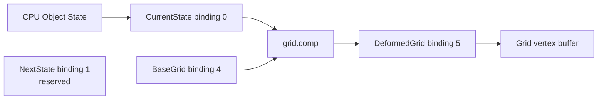

# GPU Memory Manager v1

This document describes the resource layer introduced for the OpenGL 4.3 compute path. It does not implement mass accumulation, blur, LOD, or GPU integration.

## Contract

The buffer roles and binding points are defined once in `include/gpu_memory_manager.hpp` by `BufferRole` and `BindingFor`.

| Role | Binding | Current owner | Access in this phase | Storage |
| --- | ---: | --- | --- | --- |
| `CurrentState` | 0 | CPU authoritative state mirrored to GPU | compute read | GPU resident |
| `NextState` | 1 | Reserved for future GPU integration | reserved | GPU resident |
| `ObjectPhysical` | 2 | Reserved | reserved | GPU resident |
| `ObjectControl` | 3 | Reserved | reserved | GPU resident |
| `BaseGrid` | 4 | Static grid input | compute read | GPU resident |
| `DeformedGrid` | 5 | Grid compute output | compute write | GPU resident |
| `MassField` | 6 | Reserved | reserved | GPU resident |
| `BlurFieldA` | 7 | Reserved | reserved | GPU resident |
| `BlurFieldB` | 8 | Reserved | reserved | GPU resident |
| `AccelerationField` | 9 | Reserved | reserved | GPU resident |
| `LODMetadata` | 10 | Reserved | reserved | GPU resident |
| `Metrics` | 11 | Reserved | reserved | GPU resident |

Bindings `12-15` remain reserved. The current object element is unchanged:

```cpp
struct objectStateCpu {
    glm::vec4 position_mass;
    glm::vec4 velocity_radius;
};
```

It is 32 bytes and is consumed by GLSL as two `vec4` values in `std430` layout.

## Ownership and lifecycle

`GpuMemoryManager` owns `GpuBuffer` instances. `GpuBuffer` owns one OpenGL buffer handle and is move-only. The manager is responsible for create, resize, upload, binding, destruction, and shutdown. Physics code does not call `glGenBuffers`, `glBufferData`, or `glDeleteBuffers` for simulation buffers.

The current pipeline is:



`CurrentState` and `NextState` have the same element schema. They are separate buffers for future ping-pong integration; this phase does not copy or use `NextState` each frame.

## Accounting

For every buffer:

- logical bytes = logical element count x element size
- allocated bytes = capacity x element size

The manager additionally tracks peak allocated bytes, allocation count, and reallocation count. These values describe application-visible OpenGL buffer allocations, not physical VRAM residency. Persistent mapping is not enabled because the active context is OpenGL 4.3.

## Synchronization

`grid.comp` writes `DeformedGrid`. The existing `GL_SHADER_STORAGE_BARRIER_BIT` remains before the GPU-to-GPU copy into the rendering VBO, followed by `GL_VERTEX_ATTRIB_ARRAY_BARRIER_BIT` before rendering. No global barrier or persistent mapping was added.

## Scope boundary

The CPU Direct N-body loop, collision behavior, CPU integration, and grid deformation equation remain the reference behavior. The current compute shader is still an `O(GN)` grid deformation pass; it is not Mass Accumulation.
