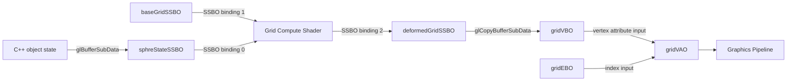

# Gravity 3D Grid: C++ and GLSL Bindings

This document describes how the OpenGL resources created by the C++ code are
connected to the GLSL compute and graphics pipelines.

## Resource flow



The compute shader writes only to `deformedGridSSBO`. The graphics pipeline
reads only from `gridVBO` through `gridVAO`. The two buffers are separate OpenGL
objects, and the transfer between them stays on the GPU.

## SSBO bindings

The C++ setup in `InitializeSimulationPipeline()` binds the buffers as follows:

```cpp
glBindBufferBase(GL_SHADER_STORAGE_BUFFER, 0, sphreStateSSBO);
glBindBufferBase(GL_SHADER_STORAGE_BUFFER, 1, baseGridSSBO);
glBindBufferBase(GL_SHADER_STORAGE_BUFFER, 2, deformedGridSSBO);
```

The compute shader declares the matching interfaces:

```glsl
layout(std430, binding = 0) readonly buffer SphereStateBuffer
{
    SphereState spheres[];
};

layout(std430, binding = 1) readonly buffer BaseGridBuffer
{
    vec4 basePositions[];
};

layout(std430, binding = 2) writeonly buffer DeformedGridBuffer
{
    vec4 deformedPositions[];
};
```

| Binding | C++ resource | GLSL block | Access | Purpose |
| ---: | --- | --- | --- | --- |
| `0` | `sphreStateSSBO` | `SphereStateBuffer` | Read | Current object positions, masses, velocities, and radii |
| `1` | `baseGridSSBO` | `BaseGridBuffer` | Read | Static, undeformed grid positions |
| `2` | `deformedGridSSBO` | `DeformedGridBuffer` | Write | Grid positions produced by the compute shader |

The numeric binding is the contract. The C++ variable name and GLSL block name
do not need to be identical.

## Object-state SSBO capacity management

The object-state buffer is now managed with an explicit GPU capacity separate from the current logical object count.

```cpp
size_t objectStateCapacity = 0;

void EnsureObjectStateCapacity(size_t objectCount)
{
    if (objectCount <= objectStateCapacity)
    {
        return;
    }

    size_t newCapacity = objectStateCapacity == 0 ? 256 : objectStateCapacity * 2;
    while (newCapacity < objectCount)
    {
        newCapacity *= 2;
    }

    sphreStateData.reserve(newCapacity);

    glBindBuffer(GL_SHADER_STORAGE_BUFFER, sphreStateSSBO);
    glBufferData(GL_SHADER_STORAGE_BUFFER, newCapacity * sizeof(SphreStateCpu), nullptr,
                 GL_DYNAMIC_DRAW);
    glBindBuffer(GL_SHADER_STORAGE_BUFFER, 0);

    objectStateCapacity = newCapacity;
}
```

Each frame, the CPU fills only the real element range:

```cpp
const size_t objectCount = objs.size();
EnsureObjectStateCapacity(objectCount);
sphreStateData.resize(objectCount);

for (size_t i = 0; i < objectCount; ++i)
{
    sphreStateData[i].position_mass = glm::vec4(objs[i].GetPosition(), objs[i].mass);
    sphreStateData[i].velocity_radius = glm::vec4(objs[i].velocity, objs[i].rs);
}

UploadObjectState(objectCount);
```

The upload path intentionally uses the active data length instead of the full GPU capacity:

```cpp
void UploadObjectState(size_t objectCount)
{
    glBindBuffer(GL_SHADER_STORAGE_BUFFER, sphreStateSSBO);
    glBufferSubData(GL_SHADER_STORAGE_BUFFER, 0, objectCount * sizeof(SphreStateCpu),
                    sphreStateData.data());
    glBindBuffer(GL_SHADER_STORAGE_BUFFER, 0);
}
```

This preserves the separation between:

- `objectCount`: the logical count of objects currently uploaded and computed
- `objectStateCapacity`: the SSBO reservation that can grow geometrically without reallocating for each small increment

## Compute dispatch and GPU copy

Each frame, the C++ code performs this sequence:

```cpp
glUseProgram(gridComputeProgram);
RunGridCompute(objectCount);

glMemoryBarrier(GL_SHADER_STORAGE_BARRIER_BIT);

glBindBuffer(GL_COPY_READ_BUFFER, deformedGridSSBO);
glBindBuffer(GL_COPY_WRITE_BUFFER, gridVBO);
glCopyBufferSubData(
    GL_COPY_READ_BUFFER,
    GL_COPY_WRITE_BUFFER,
    0,
    0,
    gridNodeCount * sizeof(glm::vec4));

glMemoryBarrier(GL_VERTEX_ATTRIB_ARRAY_BARRIER_BIT);
```

The barriers have distinct responsibilities:

1. `GL_SHADER_STORAGE_BARRIER_BIT` makes compute shader writes visible before
   the SSBO is used as the source of the copy.
2. `GL_VERTEX_ATTRIB_ARRAY_BARRIER_BIT` makes the copied data visible to vertex
   attribute fetch before drawing.

There is no `glGetBufferSubData`, buffer mapping, or CPU upload for the
computed deformation. The data flow is:

```text
Compute shader -> deformedGridSSBO -> GPU copy -> gridVBO -> graphics
```

## Vertex attribute location

The grid VAO is configured in `InitializeRenderingPipeline()`:

```cpp
glBindVertexArray(gridVAO);
glBindBuffer(GL_ARRAY_BUFFER, gridVBO);

glVertexAttribPointer(
    0,
    3,
    GL_FLOAT,
    GL_FALSE,
    sizeof(glm::vec4),
    nullptr);
glEnableVertexAttribArray(0);
```

The vertex shader declares the matching input:

```glsl
layout(location = 0) in vec3 aPos;
```

The mapping is:

```text
gridVBO -> VAO attribute location 0 -> vertex shader aPos
```

Each grid element occupies one `glm::vec4`. The shader reads the first three
components as `x`, `y`, and `z`; the fourth component is skipped by the
three-component vertex attribute.

## Index buffer and VAO state

The index buffer is attached while `gridVAO` is bound:

```cpp
glBindVertexArray(gridVAO);
glBindBuffer(GL_ELEMENT_ARRAY_BUFFER, gridEBO);
```

The resulting graphics input is:

```text
gridVAO
  |-- attribute location 0 -> gridVBO -> vec3 position
  `-- element array        -> gridEBO -> line indices
```

`gridEBO` is not used by the compute shader and is not part of the SSBO
binding table.

## Uniform locations

Uniform locations are resolved after shader linking. They are not the same as
SSBO binding points or vertex attribute locations.

For the graphics program, C++ queries names such as:

```cpp
GLint modelLoc = glGetUniformLocation(shaderProgram, "model");
GLint viewLoc = glGetUniformLocation(shaderProgram, "view");
GLint projectionLoc = glGetUniformLocation(shaderProgram, "projection");
GLint objectColorLoc = glGetUniformLocation(shaderProgram, "objectColor");
```

The compute program uses the object-count naming that matches the current
CPU-side semantics:

```cpp
glUniform1ui(glGetUniformLocation(gridComputeProgram, "u_objectCount"),
            static_cast<GLuint>(objectCount));
glGetUniformLocation(gridComputeProgram, "u_gridWidth");
glGetUniformLocation(gridComputeProgram, "u_gridHeight");
```

The corresponding GLSL declaration is:

```glsl
uniform uint u_objectCount;
uniform uint u_gridWidth;
uniform uint u_gridHeight;
```

Uniform location values can change when a shader is relinked. The uniform name
is the connection between C++ and GLSL, while the location is assigned by
OpenGL for the linked program.

## Binding types at a glance

| OpenGL mechanism | C++ side | GLSL side | Current use |
| --- | --- | --- | --- |
| SSBO binding | `glBindBufferBase(..., binding, buffer)` | `layout(std430, binding = binding)` | Compute buffers `0`, `1`, and `2` |
| Vertex attribute location | `glVertexAttribPointer(location, ...)` | `layout(location = location) in ...` | Grid position at location `0` |
| Uniform location | `glGetUniformLocation(program, name)` | `uniform type name` | Matrices, color, and compute parameters |
| VAO state | `glBindVertexArray(vao)` | Used by vertex input stage | Associates `gridVBO` and `gridEBO` |
| Copy targets | `GL_COPY_READ_BUFFER` and `GL_COPY_WRITE_BUFFER` | Not visible to GLSL | GPU-only SSBO-to-VBO transfer |

## Ownership rules

```text
baseGridSSBO
  Static compute input only

deformedGridSSBO
  Dynamic compute output only

gridVBO
  Dynamic graphics vertex input only

gridEBO
  Static graphics index input only
```

In particular, `gridVBO` must never be passed to
`glBindBuffer(GL_SHADER_STORAGE_BUFFER, ...)` or to SSBO binding point `2`.
