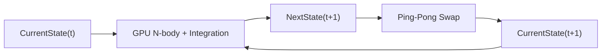

# GravitySim GPU-Resident Object State Architecture

## 1. Mục đích

Tài liệu này mô tả kiến trúc mục tiêu cho `gravity_sim` trên nhánh `feat/gpu-memory`, tập trung vào việc chuyển dữ liệu object từ CPU sang GPU-resident storage và từng bước chuyển quyền sở hữu simulation state sang GPU.

Kiến trúc được làm rõ theo ba giai đoạn chính:

1. Hoàn thiện GPU memory và object data materialization.
2. Chuyển `CurrentState -> NextState` thành state transition thực sự trên GPU.
3. Chuyển `DrawObjects()` sang GPU instanced rendering.

`src/gravity_sim_3Dgrid_baseline.cpp` được giữ độc lập làm baseline/reference implementation cho benchmark và validation. Baseline không phải là CPU mirror runtime của GPU implementation.

---

## 2. Phạm vi

### Trong phạm vi

- Object data layout trên CPU và GPU.
- GPU-resident buffers.
- `CurrentState` / `NextState`.
- Object lifecycle và upload object mới.
- `ObjectControl` làm control plane.
- `mappedPtr` cho CPU observation/debug/measurement.
- GPU N-body state transition.
- GPU instanced rendering cho objects.
- Quan hệ giữa GPU implementation và baseline.
- Synchronization và validation checkpoints.
- Khả năng mở rộng theo số lượng object.

### Ngoài phạm vi của bước hiện tại

- Thay đổi physical model của baseline.
- Refactor toàn bộ `Object` class.
- Ngay lập tức chuyển toàn bộ collision/solver architecture.
- Thay đổi các optimization algorithm như Mass Accumulation, Gaussian Blur hoặc Dynamic LOD.
- Kết luận hiệu năng trước khi có benchmark thực nghiệm.

---

## 3. Nguyên tắc ownership

Nguyên tắc trung tâm:

> CPU khởi tạo và điều khiển lifecycle; GPU giữ và tiến hóa runtime simulation state; CPU chỉ quan sát GPU state tại các checkpoint cần thiết.

Do đó cần phân biệt ba khái niệm:

```text
Initial object data
        |
        +--> GPU runtime state
        |
        +--> baseline/reference input
```

`CPU Object` không phải là một runtime shadow copy bắt buộc phải được cập nhật theo GPU ở mỗi frame.

Sau khi object được materialize lên GPU:

```text
GPU runtime state = runtime authority
```

Còn baseline:

```text
src/gravity_sim_3Dgrid_baseline.cpp
    = independent reference implementation
```

được dùng trong benchmark/validation.

---

## 4. Object data model

Object hiện tại chứa nhiều loại thông tin:

```text
Object
├── Simulation state
│   ├── position
│   └── velocity
│
├── Physical parameter
│   ├── mass
│   └── density
│
├── Derived state
│   ├── radius
│   └── rs
│
├── Interaction/control
│   ├── initializing
│   ├── launched
│   └── target
│
├── Acceleration
│   └── acceleration
│
├── Rendering
│   └── color
│
└── CPU/OpenGL resources
    ├── VAO
    ├── VBO
    └── vertexCount
```

GPU runtime representation:

```text
CurrentState
    position
    velocity

NextState
    position
    velocity

ObjectPhysical
    mass
    density

ObjectDerived
    radius
    rs

ObjectAcceleration
    acceleration

ObjectControl
    initializing
    launched
    target

ObjectRender
    color
```

`VAO`, `VBO` và các CPU/OpenGL resource handle không phải simulation data và không thuộc GPU object-state contract.

---

## 5. GPU buffer roles

### CurrentState

Runtime input state của timestep hiện tại.

```text
position
velocity
```

Producer:

```text
GPU compute / initialization upload
```

Consumers:

```text
GPU compute
GPU rendering
CPU observation at checkpoint
```

### NextState

Destination state của timestep kế tiếp.

```text
position
velocity
```

Producer:

```text
GPU compute
```

Consumer:

```text
GPU compute after ping-pong swap
CPU observation if explicitly required
```

`NextState` không cần CPU full upload mỗi frame.

### ObjectPhysical

```text
mass
density
```

Được khởi tạo từ CPU và giữ resident trên GPU.

Chỉ cập nhật lại khi physical parameter thực sự thay đổi.

### ObjectDerived

```text
radius
rs
```

Được materialize từ CPU trong giai đoạn hiện tại.

Về sau có thể được tính/duy trì trên GPU nếu cần, nhưng đây là bước mở rộng riêng.

### ObjectAcceleration

Kết quả acceleration của GPU N-body.

```text
acceleration
```

Có thể được dùng:

```text
GPU integration
CPU validation/debug via mappedPtr
```

### ObjectControl

```text
initializing
launched
target
```

Đóng vai trò control plane.

Control event từ CPU chỉ cập nhật phần object bị thay đổi, không cần upload toàn bộ object array.

### ObjectRender

```text
color
```

Phục vụ GPU rendering.

Buffer này không tham gia physics computation trừ khi một rendering rule cần control state.

---

## 6. Initial object materialization

Khi chương trình khởi tạo:

```text
CPU
 |
 | CreateObjects()
 v
Object[0..N-1]
 |
 | materialization
 v
GpuMemoryManager
 |
 +--> CurrentState
 +--> NextState
 +--> ObjectPhysical
 +--> ObjectDerived
 +--> ObjectControl
 +--> ObjectAcceleration
 +--> ObjectRender
```

Initial upload là operation theo object set.

Sau operation này:

```text
CPU -> GPU full-state upload
```

không còn là hoạt động bình thường của mỗi frame.

---

## 7. Upload policy

### Initial upload

Toàn bộ object set được upload một lần:

```text
CPU Object[0..N-1]
        |
        v
GPU buffers
```

### New object

Khi tạo object mới:

```text
CPU creates Object[N]
        |
        v
allocate/find GPU slot N
        |
        +--> CurrentState[N]
        +--> NextState[N]
        +--> ObjectPhysical[N]
        +--> ObjectDerived[N]
        +--> ObjectControl[N]
        +--> ObjectAcceleration[N]
        +--> ObjectRender[N]
```

Chỉ object mới được materialize.

Không upload lại object `0..N-1`.

### Object parameter/control update

Nếu CPU thay đổi:

```text
mass
density
color
control flag
```

thì chỉ phần tương ứng của object đó được cập nhật.

### Full upload mỗi frame

Không thuộc architecture mục tiêu.

---

## 8. Capacity management

GPU buffers cần có `capacity` lớn hơn hoặc bằng `logical object count`.

Ví dụ:

```text
capacity = 256
objectCount = 202
```

Khi thêm object:

```text
objectCount = 203
```

không cần resize.

Khi:

```text
objectCount = 257
```

mới cần resize, ví dụ:

```text
256 -> 512
```

Resize phải thực hiện khi GPU không còn sử dụng resource cũ.

Các buffer per-object phải duy trì cùng capacity:

```text
CurrentState
NextState
ObjectPhysical
ObjectDerived
ObjectControl
ObjectAcceleration
ObjectRender
```

---

## 9. GPU N-body state transition

Direct N-body vẫn có độ phức tạp:

\[
O(N^2)
\]

GPU-resident architecture không thay đổi complexity này; nó thay đổi nơi execution và data movement diễn ra.

Mỗi invocation xử lý một target object:

```text
invocation i
```

GPU đọc:

```text
CurrentState[i]
ObjectPhysical[i]
ObjectControl[i]

CurrentState[j]
ObjectPhysical[j]
ObjectControl[j]
for j = 0..N-1
```

và tính:

\[
\mathbf{a}_i =
\sum_{j\ne i}
Gm_j
\frac{\mathbf{r}_j-\mathbf{r}_i}
{\left\|\mathbf{r}_j-\mathbf{r}_i\right\|^3}
\]

Sau đó state transition:

```text
CurrentState
      |
      v
GPU N-body / integration
      |
      v
NextState
```

Không ghi trực tiếp vào `CurrentState` trong cùng state transition nếu các invocation khác vẫn cần đọc timestep hiện tại.

---

## 10. Ping-pong state

Tại timestep `t`:

```text
CurrentState = S(t)
NextState    = destination
```

GPU thực hiện:

```text
S(t) -> compute -> S(t+1)
```

ghi vào `NextState`.

Sau khi compute hoàn tất:

```text
CurrentState <-> NextState
```

Timestep tiếp theo:

```text
CurrentState = S(t+1)
NextState    = destination
```

Luồng:



Invariant:

> `CurrentState` luôn đại diện cho state của timestep đang được sử dụng làm input; `NextState` là destination của state kế tiếp.

---

## 11. N-body nên được migration theo từng bước

### Step A — Data path validation

Mục tiêu:

```text
CPU Object
    -> GPU CurrentState / Physical / Derived / Control
```

Kiểm chứng:

```text
position
velocity
mass
density
radius
rs
control
```

không bị sai layout/value.

### Step B — GPU acceleration

GPU tính:

```text
CurrentState + ObjectPhysical + ObjectControl
        |
        v
ObjectAcceleration
```

Baseline/reference được dùng để so sánh acceleration.

### Step C — GPU integration

GPU thực hiện:

```text
CurrentState + ObjectAcceleration
        |
        v
NextState
```

### Step D — Ping-pong ownership

```text
NextState
    |
    +--> becomes CurrentState
```

Khi bước này hoàn tất, GPU trở thành runtime owner của position/velocity.

---

## 12. CPU observation bằng mappedPtr

`mappedPtr` không phải là CPU simulation mirror.

Nó là observation/debug interface.

Conceptual flow:

```text
GPU buffer
    |
    | persistent mapped
    v
mappedPtr
    |
    v
CPU observation
```

CPU có thể đọc:

```text
CurrentState
NextState
ObjectAcceleration
```

khi buffer được cấu hình cho CPU read access và synchronization bảo đảm GPU write đã hoàn thành.

Ví dụ:

```cpp
const GpuObjectState* state =
    gpuMemoryManager
        .Get(BufferRole::CurrentState)
        .MappedPtr<GpuObjectState>();
```

CPU có thể đọc:

```text
state[i].position
state[i].velocity
```

mà không cần tạo một bản copy đầy đủ của GPU state.

---

## 13. Synchronization rule

Persistent mapping không loại bỏ synchronization.

CPU chỉ nên đọc GPU-produced data sau checkpoint:

```text
GPU compute
    |
    v
GPU completion / fence
    |
    v
CPU wait
    |
    v
mappedPtr read
```

Không nên:

```text
GPU compute
    |
    v
CPU read immediately
```

Vì vậy `mappedPtr` không làm cho GPU→CPU observation trở thành zero-cost; synchronization vẫn có thể tạo stall.

Architecture mục tiêu là:

```text
frequent:
    GPU -> GPU

infrequent:
    GPU -> CPU observation
```

---

## 14. Baseline và validation

Baseline nằm độc lập:

```text
src/gravity_sim_3Dgrid_baseline.cpp
```

Baseline thực hiện Direct N-body theo implementation gốc của project.

GPU path:

```text
feat/gpu-memory
```

thực hiện implementation đang được phát triển.

Hai configuration cần sử dụng cùng:

```text
initial conditions
simulation parameters
object count N
timestep configuration
hardware/software configuration
```

Validation concept:

```text
same initial condition
        |
        +--------------------+
        |                    |
        v                    v
baseline implementation   GPU implementation
        |                    |
        v                    v
reference result         GPU result
        |                    |
        +---------+----------+
                  |
                  v
             error metrics
```

Baseline không cần chạy đồng thời như một CPU shadow copy của GPU simulation.

---

## 15. Error metrics

Các metric có thể dùng cho validation:

### Acceleration error

\[
e_a =
\left\|
\mathbf{a}^{GPU}
-
\mathbf{a}^{baseline}
\right\|
\]

### Position error

\[
e_p =
\left\|
\mathbf{x}^{GPU}
-
\mathbf{x}^{baseline}
\right\|
\]

### Velocity error

\[
e_v =
\left\|
\mathbf{v}^{GPU}
-
\mathbf{v}^{baseline}
\right\|
\]

Có thể sử dụng thêm relative error:

\[
e_{rel} =
\frac{e}{\max(\|reference\|,\epsilon)}
\]

và tổng-energy drift theo methodology của đề tài.

Không yêu cầu bitwise equality giữa CPU và GPU vì floating-point operation ordering có thể khác.

---

## 16. GPU object rendering

Sau khi `CurrentState` trở thành runtime owner, `DrawObjects()` không nên tiếp tục lấy:

```text
obj.position
obj.radius
obj.color
```

từ CPU mỗi frame.

Thay vào đó dùng:

```text
CurrentState
ObjectDerived
ObjectRender
ObjectControl
```

trực tiếp trên GPU.

### Shared mesh

Tạo một sphere mesh dùng chung, nên là unit sphere:

```text
one VAO
one VBO
one sphere mesh
```

Không tạo một VBO riêng cho từng object.

### Instanced rendering

Dùng:

```cpp
glDrawArraysInstanced(...)
```

hoặc `glDrawElementsInstanced(...)`.

Mỗi instance tương ứng một object:

```text
gl_InstanceID = object index
```

Vertex shader đọc:

```glsl
CurrentState[objectIndex].position
ObjectDerived[objectIndex].radiusRs.x
ObjectRender[objectIndex].color
```

và tính world position:

```text
worldPosition =
    unitSphereVertex * radius + position
```

Luồng:

```text
CurrentState
     |
     +---- position --------+
                           |
ObjectDerived              |
     |                     |
     +---- radius ---------+
                           v
                    Object Vertex Shader
                           ^
                           |
ObjectRender --------------+
                           |
                           v
                    Instanced draw
                           |
                           v
                         Screen
```

---

## 17. DrawObjects() architecture mục tiêu

CPU không còn:

```text
for each object
    glBindVertexArray(object.VAO)
    glUniformMatrix4fv(model)
    glUniform4f(color)
    glDrawArrays()
```

Thay bằng:

```text
Bind shared sphere VAO
Bind CurrentState
Bind ObjectDerived
Bind ObjectRender
Bind ObjectControl

glDrawArraysInstanced(...)
```

Kết quả:

```text
N objects
    |
    v
1 shared mesh
    |
    v
1 instanced draw submission
```

`gl_InstanceID` xác định object index.

---

## 18. ObjectControl trong rendering

`ObjectControl` có thể được dùng để quyết định object có active hay không.

Ví dụ conceptually:

```text
initializing
launched
target
```

là metadata/control được GPU shader đọc.

Active-object compaction, indirect drawing hoặc free-list management là phần mở rộng riêng và không nên đưa vào bước đầu của GPU rendering.

---

## 19. Main loop mục tiêu

Sau khi kiến trúc hoàn thiện:

```cpp
while (!windowShouldClose)
{
    BeginFrame();

    ProcessInput();

    ProcessObjectControlEvents();

    RunNBodyCompute();

    RunIntegration();

    SwapCurrentNext();

    RunGridCompute();

    DrawGridGpu();

    DrawObjectsGpu();

    if (ValidationCheckpoint())
    {
        SynchronizeForCpuObservation();
        ReadMappedState();
        RunValidation();
    }

    SwapBuffers();
    PollEvents();
}
```

Đặc trưng:

```text
Normal frame:
    CPU control
    GPU compute
    GPU render

Validation frame:
    CPU control
    GPU compute
    GPU render
    synchronization
    CPU observation
```

---

## 20. Object lifecycle

### Initial object

```text
Create Object
    |
    v
Materialize to GPU
    |
    v
GPU slot active
```

### Simulation

```text
CurrentState
    |
    v
GPU compute
    |
    v
NextState
    |
    v
swap
```

### New object

```text
Create Object on CPU
    |
    v
find/allocate GPU slot
    |
    v
upload only new object
    |
    v
Object joins GPU simulation
```

### Parameter/control change

```text
CPU event
    |
    +--> update specific GPU field/range
```

### Debug/measurement

```text
GPU state
    |
    v
fence
    |
    v
mappedPtr
    |
    v
CPU observation
```

---

## 21. Data movement model

Architecture mục tiêu:

```text
                  CPU
                   |
       initialization/control
                   |
                   v
              GPU buffers
                   |
          +--------+---------+
          |                  |
          v                  v
     GPU simulation      GPU rendering
          |
          v
    Current <-> Next
          |
          |
          +---- checkpoint ----> CPU mappedPtr
```

Không có runtime loop:

```text
GPU state
   -> CPU full object array
   -> CPU update
   -> GPU full upload
```

mỗi frame.

---

## 22. Memory scaling

Theo data layout mục tiêu:

```text
CurrentState        32 B/object
NextState           32 B/object
ObjectPhysical      16 B/object
ObjectDerived       16 B/object
ObjectControl       16 B/object
ObjectAcceleration  16 B/object
```

Tổng:

\[
128\ \text{bytes/object}
\]

Nếu bổ sung:

```text
ObjectRender = 16 B/object
```

thì:

\[
144\ \text{bytes/object}
\]

Ví dụ, nếu chỉ xét các buffers này:

```text
N = 1,000,000
```

thì khoảng:

\[
144\times10^6 \approx 144\text{ MB}
\]

per-object allocation theo data layout trên, chưa bao gồm grid/field buffers, OpenGL resources và allocator/driver overhead.

Đây là phép tính lý thuyết từ struct layout, không phải VRAM measurement.

---

## 23. Performance model

Tách riêng các thành phần:

\[
T_{frame}
=
T_{CPU-control}
+
T_{GPU-compute}
+
T_{GPU-render}
+
T_{sync}
\]

Trong GPU-resident mode, mục tiêu là giảm:

\[
T_{CPU\rightarrow GPU\ full\ upload}
\]

và giảm CPU-side per-object rendering overhead.

Không giả định rằng GPU residency tự động làm Direct N-body thành `O(N)`. Solver complexity vẫn là:

\[
O(N^2)
\]

cho Direct N-body.

Các kỹ thuật Mass Accumulation, Gaussian Blur và Dynamic Grid/Field LOD mới là các hướng thay đổi computational workload/approximation được đề cương đặt ra.

---

## 24. Scalability implications

Khi tăng N:

### CPU upload

Initial:

\[
O(N)
\]

Object event:

\[
O(1)
\]

cho một object.

Normal frame:

\[
O(0)
\]

đối với full object upload.

### GPU Direct N-body

\[
O(N^2)
\]

### GPU rendering

Với instancing, số draw submissions không tăng tuyến tính theo N như CPU per-object draw-call loop; workload vertex/rasterization vẫn phụ thuộc N.

---

## 25. Validation modes

Nên tách ít nhất hai mode:

### Performance mode

```text
GPU simulation
GPU rendering
no full CPU state observation
```

Dùng để đo:

```text
Frame Time
FPS
GPU execution time
CPU overhead
RAM
VRAM
```

### Validation mode

```text
GPU simulation
periodic CPU observation
mappedPtr + synchronization
comparison with baseline/reference
```

Dùng để đo:

```text
acceleration error
position error
velocity error
energy drift
```

Không gộp chi phí validation/readback vào mọi frame của performance benchmark nếu mục tiêu là đo GPU-resident runtime path.

---

## 26. Compatibility với đề cương KLTN

Kiến trúc này trực tiếp hỗ trợ các phần đã có trong đề cương:

### Object State Management / GPU buffer management

Đề cương đặt mục tiêu hoàn thiện Object State Management, GPU buffer management, SSBO/data layout và Compute Shader execution path.

Architecture này hiện thực hóa các thành phần đó bằng:

```text
CurrentState
NextState
ObjectPhysical
ObjectDerived
ObjectControl
ObjectAcceleration
ObjectRender
GpuMemoryManager
```

### Baseline

`src/gravity_sim_3Dgrid_baseline.cpp` tiếp tục là baseline/reference độc lập.

### Accuracy

GPU state được kiểm tra tại checkpoint với reference/baseline bằng:

```text
acceleration error
field/state error
position error
velocity error
energy drift
```

### Ablation

Cùng state contract có thể được tái sử dụng khi thay solver:

```text
Direct N-body
Mass Accumulation
Mass + Gaussian Blur
Mass + Gaussian Blur + Dynamic LOD
```

### Scalability

Có thể benchmark theo:

```text
N
G
frame time
GPU time
CPU overhead
RAM / VRAM
```

và tách validation overhead khỏi normal runtime path.

---

## 27. Relationship với methodology

Luồng nghiên cứu:

```text
Baseline
    |
    v
Profile
    |
    v
GPU memory/data path
    |
    v
GPU compute
    |
    v
GPU state transition
    |
    v
GPU rendering
    |
    v
Validation
    |
    v
Benchmark
    |
    v
Ablation / Scalability
```

Mỗi giai đoạn có invariant riêng, giảm số lượng thay đổi đồng thời.

---

## 28. Implementation roadmap

### Phase 1 — Complete GPU Memory

Mục tiêu:

```text
Object -> GPU buffers
```

Công việc:

- Hoàn thiện buffer roles.
- Hoàn thiện initial materialization.
- Hoàn thiện per-object update.
- Hoàn thiện capacity management.
- Hoàn thiện CPU access/mapped pointer semantics.
- Xác định synchronization contract.

Verification:

```text
CPU Object fields
=
GPU mapped fields
```

### Phase 2 — Real CurrentState -> NextState transition

Mục tiêu:

```text
GPU owns position/velocity evolution
```

Công việc:

- GPU N-body.
- GPU integration.
- `CurrentState -> NextState`.
- Memory barriers.
- ping-pong swap.
- Remove full `UploadObjectState()` from normal frame loop.

Verification:

```text
GPU trajectory
vs
baseline trajectory
```

### Phase 3 — GPU Object Rendering

Mục tiêu:

```text
GPU CurrentState -> screen
```

Công việc:

- shared unit sphere mesh.
- `ObjectRender` buffer.
- object vertex shader.
- instanced rendering.
- GPU-based position/radius/color access.
- remove per-object CPU draw loop from normal runtime.

Verification:

```text
visual equivalence
+
rendering performance
```

### Phase 4 — Optimization Algorithms

Sau infrastructure:

```text
Direct N-body
    |
    v
Mass Accumulation
    |
    v
Gaussian Blur
    |
    v
Dynamic Grid / Field LOD
```

Các optimization algorithm được đánh giá riêng bằng ablation study.

---

## 29. Invariants cần giữ

### State invariant

```text
CurrentState = current simulation timestep
NextState    = next simulation timestep destination
```

### Ownership invariant

```text
GPU owns runtime position/velocity
```

### Upload invariant

```text
No full-state upload every frame
```

### Lifecycle invariant

```text
new object -> only new object/range uploaded
```

### Rendering invariant

```text
GPU renderer reads GPU-resident state
```

### Validation invariant

```text
CPU observation does not become runtime simulation authority
```

### Baseline invariant

```text
baseline.cpp remains independent
```

---

## 30. Architecture summary

Kiến trúc mục tiêu:

```text
CPU
├── Object creation
├── Input/control
├── Object lifecycle
├── Initial upload
└── Optional measurement/debug
          |
          v
GPU-RESIDENT OBJECT RUNTIME
├── CurrentState
├── NextState
├── ObjectPhysical
├── ObjectDerived
├── ObjectAcceleration
├── ObjectControl
└── ObjectRender
          |
          +--> GPU N-body
          |       |
          |       v
          |   NextState
          |       |
          |     swap
          |       |
          |       v
          |   CurrentState
          |
          +--> GPU Grid Compute
          |
          +--> GPU Instanced Rendering
          |
          +--> checkpoint -> mappedPtr -> CPU
```

Core rule:

\[
\boxed{
CPU\ initialization/control
\rightarrow
GPU\ resident\ state
\rightarrow
GPU\ compute
\rightarrow
GPU\ render
}
\]

và riêng validation:

\[
\boxed{
GPU\ state
\rightarrow
synchronization
\rightarrow
mappedPtr
\rightarrow
CPU\ observation
}
\]

Baseline:

\[
\boxed{
gravity\_sim\_3Dgrid\_baseline.cpp
\rightarrow
benchmark/reference
}
\]

được giữ độc lập, không trở thành CPU mirror của GPU runtime.

---

## 31. Source basis

### Project

- Repository: `https://github.com/quocthaile/gravity_sim`
- Branch: `feat/gpu-memory`
- `src/gravity_sim_3Dgrid.cpp`
- `src/gravity_sim_3Dgrid_function.cpp`
- `include/gravity_sim_3Dgrid_function.hpp`
- `include/gpu_memory_manager.hpp`
- `src/gpu_memory_manager.cpp`
- `src/gravity_sim_3Dgrid_baseline.cpp`

### Thesis proposal

- `DECUONGKLTN.pdf`
- Relevant sections:
  - Objectives and methodology.
  - Object State Management / GPU buffer management.
  - SSBO/data layout and Compute Shader execution.
  - Direct N-body, Mass Accumulation, Gaussian Blur, Dynamic Grid/Field LOD.
  - Numerical error and validation.
  - Benchmark, ablation study and scalability.

This document describes the target architecture and distinguishes it from the currently implemented transitional state. Performance or accuracy conclusions remain experimental until measured.
